# Radiant Architecture Design

This document is the normative architecture contract for Radiant. It defines
the intended implementation model for the public API, layout tree, and
rendering pipeline.

`TARGET.md` defines the broader direction and product boundary for Radiant.
`API.md` defines the public application-facing contract. This document makes
the implementation architecture behind those contracts explicit: how
containers and widgets differ, how declarative views become frames, and which
boundaries remain stable as the implementation evolves.

## Reading This Design

New readers should begin with Design Goals, Node Model, Canonical Application
API, Rendering Backend Architecture, and Responsive Frame and Background
Architecture. The later profiling, debugging, and verification sections define
the operational contracts that prove the design in practice.

The document has four terms that remain consistent throughout:

- **Container:** owns child placement and optional chrome.
- **Leaf node:** non-container visual content; an interactive leaf node is a
  widget.
- **Primitive painting:** backend-neutral rectangles, paths, text, images,
  clips, and other ordinary UI paint commands.
- **Paint canvas:** application-defined drawing expressed with primitive
  painting.
- **Render canvas:** a leaf node with specialized retained rendering for dense
  or custom visuals.

Primitive painting and render canvases are rendering mechanisms. Base content
and transient overlays are composition lifetimes; either mechanism may be used
in either lifetime when its cost and behavior justify it.

## Design Goals

Radiant is a declarative desktop GUI library with a small, composable API. A
reader must be able to see what a view contains, how it is laid out, and what
work a state change requires at frame time. Radiant provides generic GUI
primitives; application-specific controls, workflows, and visual recipes belong
in the consuming application.

The desired architecture is:

- one declarative container/widget tree;
- one layout ownership model;
- one backend-neutral paint plan;
- explicit retained and transient rendering layers;
- performance reuse based on declared change causes, not application guesses
  about renderer internals.

## Architecture at a Glance

```text
Application state
  → keyed declarative containers and leaf nodes
  → reconciliation, layout, and paint planning on the UI/frame runtime
  → primitive-paint segments and render canvases on the renderer adapter
  → composition and presentation

Background and realtime systems publish bounded immutable results.
They never block the interactive frame path.
```

Containers own placement; leaf nodes own content; interactive leaf nodes are
widgets. Primitive painting is the normal renderer-neutral drawing path. Render
canvases are the specialized visual path. Base and transient are composition
lifetimes, not renderer types.

## Rust Design Principles

Radiant uses Rust's ownership, type system, and thread-safety guarantees to
make the common path fast and difficult to misuse. It does not imitate a
garbage-collected component framework, a borrow-heavy callback API, or a
dynamic-dispatch scene graph.

### Ownership and thread confinement

The declarative UI tree, layout state, input state, and native renderer state
are thread-confined to the window/UI runtime. They do not require `Send` or
`Sync` merely because background work exists. Background workers exchange owned
messages, immutable snapshots, or bounded payload handles with the UI runtime;
they never borrow or mutate live UI nodes.

This permits efficient UI-local state without locks while Rust's types enforce
cross-thread transfer at the message boundary. The audio/realtime boundary uses
the same principle with bounded non-blocking transfer.

Thread bounds are capability-specific, never blanket application requirements.
An ordinary `Message`, widget, view, command mapper, and runtime-local state may
remain `!Send` and `!Sync`. Constructing a worker `Effect` requires only that
its captured work and completion payload can cross that worker boundary; sharing
an immutable `Arc<T>` between threads additionally requires `T: Send + Sync`.
UI-thread platform effects and per-window render work impose no unnecessary
cross-thread bounds. The compiler therefore rejects an unsafe transfer exactly
where it is requested rather than making the whole GUI API less ergonomic.

Radiant encodes UI affinity structurally. `ViewNode`, layout/input contexts,
widget runtime slots, and native resource handles carry an internal UI-local
marker, making them `!Send` and `!Sync` even when their visible data happens to
be transferable. They can only be created, reconciled, and dropped on their
owning window runtime. Worker effects, immutable transfer payloads, and frame
packets use separate owned transfer types, so the compiler distinguishes a safe
message boundary from an accidental UI-tree move.

### Public construction model

Views and messages own the data needed after construction. Public view builders
avoid long-lived borrowed callbacks and self-referential structures. User
events emit owned application messages; reducers own state mutation; background
results return owned values or `Arc`-backed immutable payloads.

```rust
button("Save").on_press(Message::Save)

// No callback keeps a mutable borrow of application state alive inside the UI.
text_input(state.query.clone()).on_change(Message::SetQuery)
```

This model keeps lifetimes local and makes asynchronous completion, cancellation,
reprojection, and testing straightforward.

### Static dispatch and extension boundaries

Built-in primitives use closed internal representations and static dispatch on
the hot layout and paint paths. Public custom widgets use an object-safe trait
at an explicit extension boundary. Radiant boxes or type-erases once at that
boundary; it does not require a trait-object call for every built-in primitive,
style property, or paint operation.

The common `ViewNode<Message>` representation is an owned, normalized boundary
that permits heterogeneous child collections such as `row([text(...),
button(...)])`. Its internal storage uses compact tagged nodes and stable arena
handles where that avoids repeated heap allocation or pointer chasing.

Type erasure occurs exactly once at an explicit extension boundary. Custom
widgets become an internal tagged/`Any`-backed widget entry, render canvases
become a registered canvas-program entry, owned resource branch factories become
a selected `ViewNode`, and worker effects become an owned task entry. Built-in
primitives, layout/style values, paint primitives, and ordinary application
composition remain statically dispatched. Erased entries carry their concrete
type identity, schema/contract version, and destructor ownership, so downcasts
and cleanup are checked at the narrow internal boundary rather than leaking
trait objects throughout the public API.

### Keys, handles, and storage

Application-facing continuity tokens use distinct Rust newtypes such as
`ContinuityKey`, `CanvasKey`, `OverlayKey`, `WindowKey`, `ResourceKey`,
`AnchorKey`, and `ColumnId`; APIs do
not accept interchangeable raw integers or strings. They are advanced opt-ins,
not required constructor arguments. `WidgetId`, `ContainerId`, and `OverlayId`
are generated runtime identities exposed read-only to diagnostics, inspection,
and profiling. Internal arena indices are generational and never exposed as
persistent public identity.

Small child lists, damage regions, active animations, diagnostics, and frame
scratch use inline or reusable storage where appropriate. Large immutable media
and visualization payloads use shared ownership rather than repeated cloning.

### Error and unsafe boundaries

Normal API misuse that can be detected during construction returns a typed
diagnostic or `Result` at an explicit boundary. Native-window, GPU, and platform
failures use typed errors plus structured diagnostics; recoverable runtime
conditions do not rely on `panic!`.

`unsafe`, platform FFI, GPU-resource interop, and raw-window-handle work remain
in narrow renderer/platform modules with documented invariants. Safe public
Radiant APIs never expose raw lifetime, aliasing, or thread-affinity hazards.

Panics are not a Radiant error or cancellation mechanism. Pure Rust application
and extension code follows normal Rust panic semantics, while expected failures
use `Result`, effects, and diagnostics. Every platform callback, FFI trampoline,
and foreign renderer boundary contains unwinding before it can cross into native
code. If an unwind reaches that boundary, Radiant records a fatal structured
diagnostic, stops admitting work for the affected window, and performs only
safe fence-aware retirement; it never resumes through potentially inconsistent
foreign state or unwinds across FFI.

### Rust API constraints

Macros may reduce repetitive child assembly, but ordinary view construction
remains normal Rust values and methods. Generic types are used where they
improve correctness or eliminate allocation; they are not allowed to make the
normal application API unreadable, prevent heterogeneous child lists, or create
monomorphization-heavy compile-time costs without measured benefit.

### Extension evolution

`Widget` and `LayoutPolicy` are deliberately small stable cores. New optional
behavior is introduced through focused capability traits—such as
`WidgetSemantics`, `WidgetHitTest`, `ContainerSemantics`, `LayoutInteraction`,
`VirtualLayoutPolicy`, or `Animatable`—rather than by adding required methods
to every custom implementation. Each capability has an explicit contract
version and graceful absence behavior; Radiant discovers only the capabilities
an extension declares. A changed interpretation requires a new capability
version or a semver-major trait revision, never a silent change to existing
widget or container behavior. This gives application-owned controls and layouts
a durable Rust extension boundary without freezing the rest of the GUI library.

## State Domains and Scheduling

Radiant keeps four state domains separate:

| Domain | Owner | Examples |
| --- | --- | --- |
| Domain state | Application | samples, tracks, clips, project data |
| Persistent UI state | Application | panel layout, open tabs, selection, persisted scroll restore positions |
| Transient UI state | Radiant runtime | hover, drag, focus, pointer capture, live scroll offsets, animation progress |
| Renderer state | Native backend | scenes, textures, glyph caches, GPU resources |

Only domain and persistent UI state are application projection inputs.
Transient UI state and renderer state remain runtime-owned whenever possible,
so pointer motion, focus, drag, and animation do not mutate the application
model or reproject unrelated UI.

Messages are processed in deterministic order. Reducers update application
state and return owned effects; the runtime executes those effects only after
the state commit. The scheduler coalesces all available work into one
presentation opportunity while preserving observable message order. Async work
is keyed, cancellable, and generation-checked so a stale completion cannot
overwrite newer state.

### Controlled and runtime-local reconciliation

Interactive layout state has two explicit modes. The default is runtime-owned:
an initial or restored value seeds a newly mounted keyed node, after which
scrolling, viewport pan/zoom, splitter movement, and floating-panel drag update
runtime state immediately without being reset by an unrelated reprojection. An
optional settled message persists the resulting value in application state.

An application may instead opt into controlled state when it needs an external
authority, collaboration, or undo-driven value. A controlled value carries a
monotonic generation; Radiant applies it only when the generation advances, so
the same stale value projected after a local interaction cannot snap the UI
backward. Explicit application generations always win over runtime-local state.

```rust
scroll(project_content(state))
    .initial_offset(state.saved_scroll_offset)
    .on_offset_settled(Message::SaveScrollOffset);

coordinate_viewport(editor(state))
    .controlled_transform(
        Controlled::new(state.view_transform, state.view_transform_generation),
    );
```

The same rule applies to restored window geometry, floating-panel placement,
text-editor composition, and any layout-interaction capability. It gives the
common case immediate feedback and the advanced case deliberate external control
without competing sources of truth.

All retained interactive APIs use the same vocabulary: `initial_*` seeds a newly
mounted node once; the runtime owns live interaction thereafter; `controlled_*`
accepts a generation-bearing external authority; and `on_*_settled` persists the
result when desired. A text value carries its document revision as that
generation, so ordinary `text_input(value)` and `text_editor(document)` remain
concise while still rejecting a stale reprojection during IME composition or
editing.

All deferred work uses one owned effect model. `Effect<Message>` covers worker
tasks, platform operations, timers, asset preparation, and other asynchronous
work. Every effect has a typed key, generation, cancellation policy, and owner
(application, window, overlay, or keyed node). Replacing a key cancels or
supersedes its older effect; destroying its owner cancels dependent work; late
results are rejected before reduction. There is no second, ad hoc task lifecycle
outside this model.

### Runtime lifecycle and non-reentrancy

Each application runtime moves through explicit `Starting`, `Running`,
`Closing`, `Recovering`, and `Stopped` states. The event loop is non-reentrant:
it dequeues one input, lifecycle event, or completed effect; reduces state;
commits state and effects; then schedules view/frame work. An effect completion
is always queued for a later event-loop turn, even if a platform service
finishes synchronously. No callback can enter a reducer, layout pass, or paint
pass recursively.

Window close cancels or detaches window-owned effects, releases window-local
runtime state, stops presentation, and hands native resources to fence-safe
retirement. Application shutdown first stops new admission, then cancels
application-owned effects, drains only bounded required lifecycle work, and
releases adapters without waiting on unbounded worker or GPU completion. Device
loss enters `Recovering`: state and effects remain valid, affected adapter
resources advance generation, and visible windows rebuild lazily. Every
lifecycle transition emits typed diagnostics and is replayable in the test host.

```text
event or task completion
→ reduce owned application state and emit owned effects
→ commit state, execute effects, and classify change
→ project affected declarative view
→ reconcile and schedule one frame
```

## Theme and Styling Architecture

Themes use typed semantic tokens and compact style values. They are not a CSS
cascade, string-key lookup system, or collection of arbitrary visual helper
names.

```rust
button("Save")
    .style(ButtonStyle::primary())
    .on_press(Message::Save)

container(content)
    .style(ContainerStyle::panel())
```

```text
theme.button.primary.background
theme.button.primary.hover_background
theme.panel.border
theme.text.muted
```

Widgets and container chrome resolve a node-specific `ResolvedAppearance` from
the active theme, semantic variant, narrowly scoped explicit override, and
current visual state such as enabled, hovered, pressed, focused, selected, and
disabled. It is immutable frame data; custom extensions receive it through
their normal contexts rather than recreating theme or interaction-state logic.
Theme changes are classified as paint or geometry changes only when the changed
token can affect sizing. Applications compose styles from named typed values
rather than exposing raw colors, fonts, and border recipes throughout view code.

## Locale and System Environment

Radiant exposes immutable, testable environment snapshots at two scopes.
`ApplicationEnvironment` contains locale, writing direction, system color
scheme, contrast preference, default reduced-motion preference, and platform
shortcut presentation. `WindowEnvironment` contains the current display scale,
monitor color space, pointer/input conventions, per-window accessibility or
motion overrides, and other native-surface facts. Applications normally follow
the system or supply an explicit override for a window or test; individual
widgets do not query platform state.

```rust
text(localized(TextKey::sample_count(), [state.samples.len().into()]));

button(localized(TextKey::save(), []))
    .command(CommandId::Save);
```

Application-environment changes invalidate all affected windows; window-
environment changes invalidate only that window's dependent text layout, target,
and paint resources. Locale, direction, and font fallback changes invalidate
affected text layout and geometry. Color-scheme and contrast changes invalidate
resolved style/paint; reduced-motion changes retarget or disable nonessential
transitions; platform shortcut presentation updates command menus and help
without changing semantic bindings. Environment changes are delivered as owned
events, replayable in the deterministic host, and profiled like other
invalidation causes.

## Components and Workspace Composition

Application components are ordinary Rust functions that accept owned or
borrowed application state and return an owned `ViewNode<Message>`. They have
no renderer lifecycle, hidden callback state, or framework-specific component
object.

```rust
fn transport_bar(state: &TransportState) -> ViewNode<Message> { /* ... */ }
fn browser_panel(state: &BrowserState) -> ViewNode<Message> { /* ... */ }
fn arrange_view(state: &ArrangeState) -> ViewNode<Message> { /* ... */ }
```

Radiant also provides a generic desktop workspace composition layer for editor
applications: split panes, tabs, docked panels, floating panels, and serializable
workspace layout. It stores durable workspace state in the application domain,
restores it safely across monitor/layout changes, and lowers it into ordinary
containers and overlay-host entries. It never becomes a product-specific shell.

The workspace API is declarative and keyed. Applications supply the available
panel content and persist a typed layout value; Radiant supplies docking targets,
split resizing, tab interaction, floating-panel handoff, minimum-size handling,
and monitor-aware geometry clamping.

```rust
workspace(state.workspace.clone())
    .panel(PanelId::browser(), browser_panel(state))
    .panel(PanelId::arrange(), arrange_view(state))
    .panel(PanelId::mixer(), mixer_view(state))
    .on_layout_change(Message::SetWorkspaceLayout)
    .on_panel_close(Message::ClosePanel)
```

The application may create its initial layout and decide which panels exist,
but it never calculates drop zones, tab-strip geometry, splitter capture, or
monitor corrections itself. Workspace changes are ordinary application messages,
making layouts undoable, serializable, replayable, and safe to restore when a
saved display is no longer present.

`WorkspaceLayout` is a versioned typed persistence value. Restoration receives
the application's current panel registry and produces a `WorkspaceRestoreReport`.
Unknown or unavailable panel IDs—such as a removed plug-in editor—become a
visible dormant-panel placeholder that preserves its slot and serialized data,
or are pruned only under an explicit application policy. Applications provide
an ID migration when a panel is renamed; Radiant never loads a plug-in or
creates an arbitrary panel merely because persisted data names one. Invalid or
unsupported layout versions fall back to the declared initial workspace with a
bounded diagnostic, while retaining the original payload for application-led
migration or recovery. Floating geometry is clamped to the current monitor
topology; a missing display restores to the primary display without discarding
the rest of the workspace.

## Deterministic Testing and Replay

The runtime supports a headless deterministic mode without a native window or
GPU. Tests may supply fixed viewport, DPI, theme, time, input events, and task
completions, then inspect structured outputs:

- layout rectangles and overflow;
- semantics and focus path;
- paint plan and render-boundary decisions;
- invalidation, diagnostics, and profile events;
- overlay placement and dismissal;
- message/state transitions.

The deterministic clock advances animation and timed work without wall-clock
sleep. Captured event/message traces may be replayed against the same view and
state to reproduce interaction bugs. Pixel comparison remains available for
renderer integration, but structured snapshots are the primary regression tool
for application and runtime behavior.

## Responsive Frame and Background Architecture

Responsiveness is a first-class contract. Pointer movement, hover feedback,
focus, input routing, transient overlays, and frame presentation never wait for
filesystem, decode, database, network, process, long CPU, worker completion, or
unbounded lock acquisition.

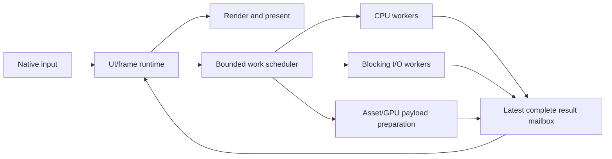

### Logical and physical execution boundary

The UI/frame runtime owns native input, transient interaction state, view
reconciliation, layout, scheduling, and presentation coordination. Background
workers own slow or blocking work. They communicate only through bounded,
owned messages and immutable snapshots. Worker tasks, timers, asset preparation,
and platform operations are all executed from the same post-reducer effect queue
with the ownership and generation rules defined in State Domains and Scheduling.

The logical boundary is mandatory. A separate physical render thread is
optional and platform-dependent: some native window systems require window or
GPU presentation affinity on the main/UI thread. Where that is true, Radiant
keeps render submission on the frame thread but preserves the same non-blocking
mailbox contract. Where the platform supports a dedicated render owner,
Radiant may submit immutable frame packets to it without changing application
semantics.

### Frame-path rules

- The frame path never synchronously waits for a worker result.
- Effect outputs are complete immutable values; partially prepared data is not
  read by the renderer.
- Visual work uses latest-wins mailboxes when only the newest result matters;
  stale decode, analysis, waveform, and preview work is cancelled or dropped.
- Effect queues are bounded and have explicit overload policy. No producer may create
  unbounded frame latency or memory growth.
- Locks on the frame path are avoided. Shared data uses ownership transfer,
  atomics, or immutable snapshots; any unavoidable lock has a measured bounded
  scope and a fallback diagnostic.
- A slow application reducer or projection is diagnosed and must move heavy
  work to the scheduler rather than stealing frame time.

### Immediate interaction path

Hover, pointer capture, cursor changes, drag affordances, caret blinking, and
small selection overlays are runtime-local transient state. They update from
the current resolved layout and hit-test index without waiting for application
projection or background work. A worker result may update base content later,
but it cannot prevent immediate interaction feedback.

### High-rate interaction delivery

Radiant separates immediate runtime feedback from application message delivery.
Press, release, enter, leave, cancellation, focus, command, and capture-loss
events are never coalesced. Pointer motion, pixel scrolling, pinch updates,
pen samples, and continuous drag positions may be coalesced to the newest sample
per frame when delivered to application state. Coalesced events retain the
latest position, modifiers, timestamp, sequence range, and accumulated deltas,
so controls can preserve velocity and total scroll distance without receiving an
unbounded message stream.

```rust
arrange_view(state)
    .on_pointer(PointerDelivery::coalesced(Message::ArrangePointer))
    .on_gesture(GestureDelivery::coalesced(Message::ArrangeGesture));
```

Immediate visual feedback, pointer capture, drag preview position, hover, and
cursor choice remain runtime-local even when application delivery is coalesced.
Applications may request uncoalesced samples only for a named high-precision
interaction; the runtime rate-limits and profiles that path, and it cannot
create an unbounded frame queue.

### Frame packets and backpressure

A render packet contains only immutable references or owned frame data:
resolved layout/paint revisions, retained render-canvas updates, transient overlay
data, and target generation. The frame runtime publishes at most the work the
presenter can consume under its bounded policy. If rendering falls behind,
Radiant coalesces obsolete visual packets and presents the newest valid state;
it does not queue an ever-growing history of stale frames.

Every frame packet owns or `Arc`-pins the CPU payloads it references. Native
resources are retired only after the renderer knows that every submitted frame
referencing them has completed. Replacing a canvas, resizing a target, or
recovering a device therefore creates a new generation and defers old-resource
destruction safely; worker results cannot free or mutate resources used by an
in-flight frame.

Profiling reports frame-path stalls, queue depth, stale-work cancellation,
coalesced updates, input-to-present latency, and missed presentation deadlines.
The design goal is not an impossible guarantee that a saturated GPU or paused
operating system can never delay a frame; it is that Radiant itself never makes
the interactive path wait on unrelated application work.

### Frame pacing, priority, and budgets

Applications may select an animation and presentation target cadence:

```rust
window("Wavecrate")
    .frame_rate(FrameRate::Hz60)
```

The supported target choices are `Hz30`, `Hz60`, and `Hz120`. They are maximum
presentation cadences, not guarantees: the effective cadence is bounded by
display capability and present mode. Radiant reports the effective rate rather
than claiming an unavailable rate. Input is processed immediately at every
setting; a lower cadence only limits when the next visible presentation may
occur. An idle window requests no periodic frames. Active animation and
visualization work is paced to the selected cadence without busy waiting.

Native input and active interaction state have priority over background-result
delivery, cache warming, prefetch, and idle maintenance. Pointer motion
coalesces to the newest position when a frame is pending. The presenter keeps a
bounded frames-in-flight policy: the frame being consumed plus at most one
newest pending frame. Obsolete packets are replaced rather than queued.

The runtime exposes configurable soft budgets for input dispatch, transient
feedback, projection, layout, paint planning, encoding, and presentation.
Budget breaches are profiler and diagnostic events with stage, selected scope,
queue depth, and invalidation context. Worker admission control reserves CPU
capacity for the UI/frame runtime; visible and user-requested work outranks
prefetch and cache warming. Development and test hosts may promote selected
budget breaches to failures, making the non-blocking frame-path contract
enforceable rather than advisory.

### Cross-window CPU frame fairness

When native windows share a UI thread, Radiant uses an application-level CPU
frame scheduler in addition to each window's local scheduler. Input dispatch,
transient feedback, and deadline-bound presentation are admitted first. View
projection, reconciliation, layout, paint planning, and debug work run only at
safe stage boundaries; an incomplete stage is never presented, but stale
low-priority work may be coalesced or deferred before its next stage begins.

Each window receives a bounded CPU work quota informed by its requested cadence,
input activity, and missed-frame history. A slow window is profiled and
deprioritized for nonessential work rather than allowing it to delay another
window's pointer feedback. The scheduler records per-window CPU admission,
deferred stages, input-to-present latency, and budget breaches. It does not
attempt unsafe mid-layout interruption; fairness is achieved at explicit
projection, layout, and paint-plan boundaries.

## Node Model

Radiant has two distinct node kinds. They are deliberately separate.

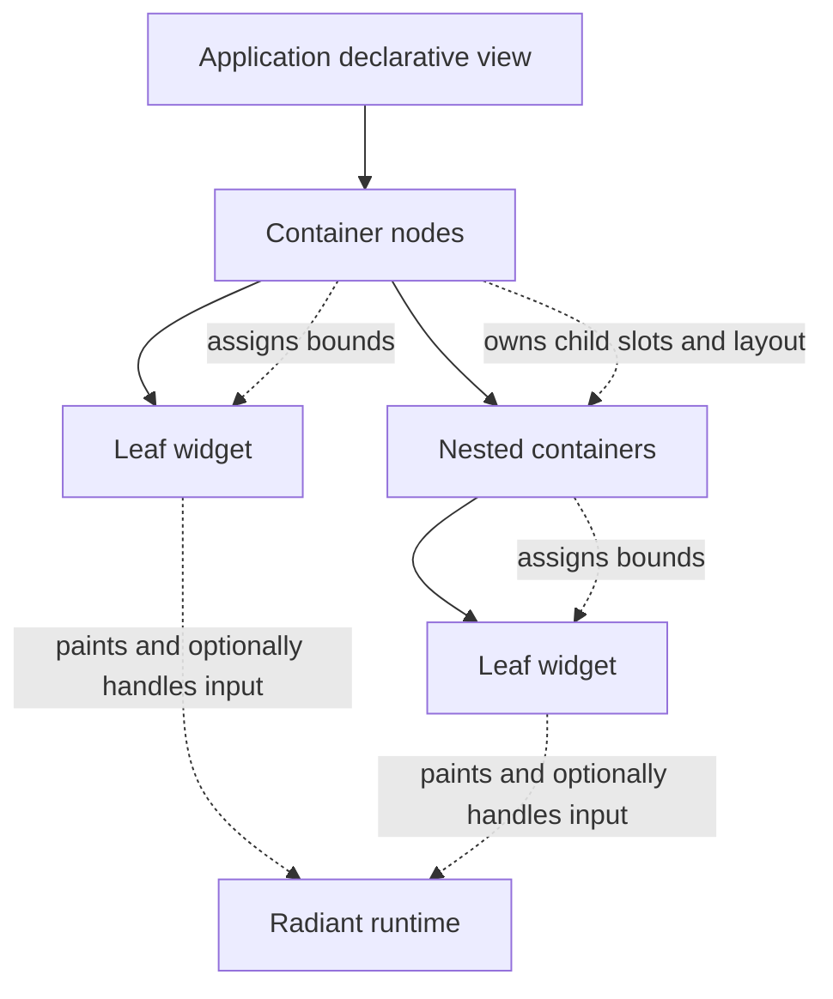

### Containers

Containers contain child nodes and own their layout. Their responsibilities
are:

- ordered child slots;
- layout policy and sizing constraints;
- spacing, padding, alignment, wrapping, scrolling, clipping, and layering;
- optional visual chrome such as a background, border, or rounded shape.

Containers are not widgets. A container may paint chrome, but it does not
acquire widget focus, editing, semantic actions, or arbitrary retained
interaction state merely because it is visible.

Some layout policies need narrow **layout interaction** to perform their own
job: scrolling changes a viewport offset, a splitter changes slot allocation,
and a workspace dock target tracks a prospective insertion zone. This is a
container capability, not widget behavior. `LayoutInteraction` may consume the
relevant pointer or scroll stream, own runtime-local layout state keyed by the
container, request layout/overlay updates, and emit an application message for
durable persistence. It cannot become a keyboard-focus target, expose a
semantic control role, or mutate application state directly.

```rust
scroll(project_content(state))
    .initial_offset(state.project_scroll_restore)
    .on_offset_settled(Message::PersistProjectScroll);
```

The live offset updates immediately in runtime state; the optional settled
message lets the application restore the position later. This keeps scrolling
and splitter feedback responsive without turning containers into widgets or
requiring every pointer movement to reproject application state.

`scroll(content)` supplies the ordinary automatic behavior: clipped viewport,
wheel and trackpad consumption, keyboard scrolling, focus reveal, and a
platform-appropriate scrollbar. Applications may opt into a `ScrollPolicy` to
choose overlay or reserved-gutter bars, automatic/always/hidden visibility,
axis locking, page amount, and Home/End behavior. Scrollbars are container
chrome and layout interaction, not widgets; they expose scroll semantics to
accessibility and participate in the same gesture arena as the viewport.

Focus, keyboard navigation, and assistive technology use `scroll_to_reveal`
automatically when the target is clipped. An application may issue a
generation-bearing `ScrollRequest` for a keyed item, rectangle, or edge with a
start, center, end, or nearest alignment. The runtime consumes a request once;
it does not reset a live offset like an `initial_offset` value. Programmatic
scrolling may animate through the central animator, but reduced-motion policy
uses an immediate reveal unless the application explicitly requires otherwise.

### Layout protocol

Every container, built-in or custom, follows one layout protocol. Layout uses
finite logical coordinates in device-independent units; `LayoutUnit`,
`LayoutSize`, and `LayoutRect` reject non-finite values. Rectangle origins may
be negative for translated, offscreen, or overlay content, while negative or
inverted extents are rejected at their construction boundary. Fractional logical bounds
remain intact through measurement, placement, hit testing, and damage. Only the
renderer maps them to physical pixels, using one target-wide snapping policy so
adjacent edges do not drift or leave DPI-dependent gaps.

Layout has two ordered phases:

1. **Measure, bottom up.** A container gives each child normalized constraints
   and receives a `SizeHint` with intrinsic minimum, preferred extent, optional
   maximum, and baseline information where applicable. A child may not inspect
   its parent bounds, sibling bounds, or prior frame geometry while measuring.
2. **Place, top down.** After the container resolves its own bounds, it assigns
   each child a logical rectangle and optional baseline alignment. Paint, hit
   testing, semantics, clipping, and damage consume that one resolved output;
   they never recalculate geometry independently.

Constraints are a normalized minimum and maximum for each axis. A maximum is
either finite or explicitly unbounded; invalid ranges are construction
diagnostics, never values that silently flow through layout. A scroll viewport
passes a finite cross-axis constraint and an explicitly unbounded content-axis
constraint, while retaining a finite viewport rectangle for clipping and input.
Percentage sizing resolves only against a known finite containing axis. Fixed
sizes are clamped to the normalized range; intrinsic minimums protect `shrink`;
and `fill` or `grow` consumes remaining finite placement space only after the
container has measured its children. An unresolved relative value emits a
layout diagnostic and takes the conservative intrinsic fallback rather than
creating a sizing cycle or non-finite result.

Measurement caches are keyed by node identity, exact geometry revision,
normalized constraints, resolved layout style, locale/direction, text scale,
and relevant environment generation. Placement caches additionally include the
resolved container bounds and layout-policy revision. Baseline alignment is a
first-class cross-axis policy; containers that do not request it pay no
baseline-measurement cost.

`MeasureChildren` memoizes identical child/constraint requests within a layout
pass. It records total calls and distinct constraints per child, so a custom
policy that repeatedly measures a child or creates quadratic layout work is
visible in profiles and emits a development diagnostic; strict layout tests may
promote the configured threshold to failure. A policy may request a genuinely
different constraint when its algorithm requires it, but it cannot hide
unbounded remeasurement behind the extension boundary.

### Custom container extension

Radiant includes the common layout containers—`row`, `column`, `stack`, `grid`,
`container`, `scroll`, virtual collections, coordinate viewports, and workspace
composition—but applications may define a reusable layout type whenever those
policies do not express their editor. A custom container is not a `Widget`.
It is an immutable declarative `LayoutPolicy` projected through the same normal
container node as every built-in policy.

```rust
layout(
    TimelineLayout::new(state.timeline_zoom),
    [track_headers(state), arrangement_canvas(state)],
)
.padding(Insets::all(8))
.clip(Clip::bounds());
```

The policy receives controlled child-measure and child-placement contexts. It
may measure each declared child under a normalized constraint, choose its own
container size, and assign each child a bounds rectangle. It may emit optional
chrome paint in its declared container layer. Those contexts expose an
immutable `ResolvedEnvironment`—scale, locale, direction, contrast, motion
policy, and accessibility settings—plus the container's node-specific
`ResolvedAppearance`, without exposing raw theme storage, renderer handles, or
native platform state. A policy does not receive live child nodes, mutable
application state, arbitrary widget input, or permission to retain children
outside the current projection.

```rust
trait LayoutPolicy {
    fn measure(
        &self,
        children: &mut MeasureChildren<'_>,
        constraints: Constraints,
    ) -> SizeHint;

    fn place(
        &self,
        children: &mut PlaceChildren<'_>,
        bounds: LayoutRect,
    );

    fn append_chrome(&self, _paint: &mut ChromePaintContext<'_>) {}
}
```

`PlaceChildren` validates slot completion. Every declared child is placed
exactly once or explicitly omitted with a declared reason such as
virtualization or conditional layout; duplicate placement and implicit
omission are development diagnostics and strict-test failures. The declarative
child order is the default semantic reading order. A custom policy may supply a
validated alternate semantic order when its spatial layout requires one, but
visual placement alone never silently changes accessibility or keyboard order.

`LayoutPolicy` has a conservative layout revision by default. A policy on a
measured hot path may derive or explicitly provide structure, geometry, chrome,
and interaction components so Radiant can choose narrower invalidation. The
default always takes the broader correct path; custom containers never select
raw repaint or cache scopes themselves.

Radiant derives child and container identity, owns clipping, hit testing,
accessibility traversal, focus routing, damage propagation, and runtime-local
state lifetime. A policy that needs scrolling, split resizing, docking preview,
or another container-specific gesture opts into the focused `LayoutInteraction`
capability. That capability may claim only its declared layout hit regions,
update runtime-local container state, request layout or transient-overlay work,
and emit a message for settled persistence. It cannot turn the container into a
semantic widget or mutate application state directly.

Container interaction state uses a generated `ContainerStateId` containing the
container's runtime identity, concrete state type, and schema version. The
state is `'static`, explicitly initialized, window-local, and never `Send` or
shared with application state. A changed type or schema drops and recreates the
slot deterministically with a development diagnostic, matching widget-state
safety rather than reusing incompatible scroll, splitter, or dock state.

A custom container may opt into `ContainerSemantics` when it represents
meaningful structure such as a labelled group, region, landmark, or editor
workspace. This contributes structural accessibility information and semantic
child ordering only; it does not make the container focusable or an interactive
control. A custom container may also opt into `Animatable` for declarative
chrome or placement transitions. It declares target properties and transition
policy; Radiant's central animator owns interpolation, frame wakeups,
retargeting, reduced-motion handling, and invalidation selection.

Large custom collections use a separate `VirtualLayoutPolicy` capability rather
than bypassing Radiant's visible-window model. It declares keyed range-to-bounds
mapping, anchoring, estimated or measured extent, and on-demand semantics;
Radiant continues to own materialization, focus, accessibility, culling, and
recycling. This keeps a custom timeline or piano roll as safe and incremental as
the built-in virtual list.

### Leaf content and interactive widgets

Leaf nodes are placed by containers. Passive content such as text, icons,
images, separators, and decoration paints within assigned bounds. Interactive
widgets are leaf nodes with input, focus, accessibility, or widget-local
interaction state. Their responsibilities are:

- intrinsic sizing information;
- content paint within assigned bounds;
- optional input, focus, accessibility, and widget-local transient state;
- mapping widget output to an application message.

Leaf nodes do not own children or choose a layout policy for siblings.

### Identity and lifecycle

Every container, widget, overlay, render canvas, and auxiliary window has a
stable identity across reprojection. Radiant generates it automatically from
the window root, declarative ancestry, node kind, and static child position in
the normal case; ordinary buttons, containers, and fixed view structure never
need an application-supplied key. In a repeated dynamic collection, Radiant
uses an item's `Keyed`/`Identifiable` implementation automatically, so typical
domain values with an ID also need no explicit key at the call site.

An explicit local key is only the escape hatch for data that has no stable
identity, custom reconciliation, or intentionally replaceable state. It need
be unique only among keyed siblings or entries of one collection; Radiant still
derives the fully scoped runtime identity. Positional identity is valid only for
statically ordered children. Duplicate inferred or explicit sibling identities
are construction diagnostics in all builds and deterministic debug errors with
the resolved tree path.

Generated identity is deterministic and allocation-free on the frame path: the
runtime uses compact structural scopes for static children and a copied typed
domain key for repeated `Keyed` values. It never generates random IDs, formats
strings, performs global matching, or scans unrelated siblings to guess
identity. Inferred collection identity therefore has the same reconciliation
cost as an explicit key extractor. A dynamically reordered collection whose
items have no stable identity is rejected from the keyed collection API rather
than silently using positional identity and reusing the wrong state.

### Identity decision guide

Application authors do not normally decide identity manually.

| View situation | What the application writes | Identity behavior |
| --- | --- | --- |
| A normal static button, label, panel, or canvas | ordinary constructor | generated from its static structural position |
| A repeated domain collection whose item type implements `Keyed` | `for_each(items, item_view)` | inferred from the domain item's typed stable key |
| A repeated value that has a stable domain ID but no `Keyed` implementation | implement `Keyed` once on its domain type | inferred identity thereafter, with no view-level key |
| A repeated value with genuinely no stable identity that may reorder | introduce a real domain identity or keep the order static | diagnostics prevent unsafe state reuse |
| A conditional replacement that must preserve a particular transient state across a structural change | `preserve_state(ContinuityKey, view)` | explicit local continuity request |

The runtime reports why an explicit key is required and identifies the affected
collection or replacement path. It never asks an implementer to add IDs
defensively to ordinary static view code.

This rule is expressed by the API and type system, not left to documentation
memory. `for_each(items, item_view)` is available only when the item type
implements `Keyed`; otherwise Rust reports the missing bound and points to the
one-time `Keyed` implementation or explicit `for_each_by` escape hatch. Static
container constructors never request a key. The advanced state-continuity API is
named `preserve_state(key, view)` so its purpose is visible at the call site,
rather than presenting a mysterious mandatory ID option on every primitive.
Duplicate or unstable inferred keys include the collection path and corrective
action in their diagnostic.

Identity mistakes are caught at the earliest useful stage:

1. **Compile time:** `for_each` rejects an item type without `Keyed`, with a
   targeted trait-bound error. This prevents an unkeyed dynamic collection from
   reaching a running application.
2. **Development runtime:** duplicate sibling keys, incompatible keyed-node
   replacement, and discarded widget runtime state emit structured
   `IdentityDiagnostic` events with the resolved tree path, previous/new node
   kind, and affected focus/capture/state. The inspector highlights the node.
3. **Tests and CI:** `IdentityAudit::strict()` promotes those diagnostics to
   deterministic test failures. Replay scenarios may insert, remove, filter,
   sort, and reorder collections while asserting that focus, selection, scroll
   anchor, and retained state remain attached to the intended key.

Production builds recover safely by discarding incompatible runtime state rather
than reusing it, while emitting bounded diagnostics according to the configured
diagnostic level.

When a node disappears, the runtime releases focus, pointer capture, overlay
ownership, retained widget state, and native resources associated with it.
Reusing an identity for an incompatible node kind is an explicit replacement
transition, not accidental state reconciliation.

### Declarative view example

```rust
column([
        container(
            row([
                text("Project"),
                button("Save").on_press(Message::Save),
            ])
            .gap(6),
        )
        .padding(Insets::all(12))
        .border(Border::subtle()),
        scroll(
            column([
                text("Recent activity"),
                status_list(state.entries),
            ])
            .gap(4),
        ),
])
.gap(8)
```

In this example, the column, row, generic container, and scroll node own
placement. `text`, `button`, and the application-owned `status_list` are leaf
widgets. The border belongs to the container's chrome rather than a special
"bordered row" widget.

The canonical construction form is `container_kind([children])` followed by
configuration. `container(child)` is the corresponding single-child form for
wrapping content in chrome, padding, or a clipping boundary.

## Canonical Application API

Normal application code uses generic constructors and fluent, orthogonal
configuration.

```rust
button("Save")
    .icon(icon::SAVE)
    .style(ButtonStyle::primary())
    .enabled(state.can_save)
    .on_press(Message::Save)
```

The constructor names the primitive. Each builder method configures one
independent concern. A combined visual outcome is composed from primitive,
style, icon, sizing, and state; it is not encoded in a separately named
framework helper.

### API rules

- The common case is complete with a constructor and only the behavior it needs:
  `button("Save").on_press(Message::Save)` is the intended whole API for a
  normal button. Identity, accessibility defaults, style resolution, focus
  behavior, invalidation, and renderer choices are automatic.
- Advanced capability is progressive: a builder exposes an optional concern only
  when an application needs that concern. A static view needs no key; a dynamic
  repeated view adds one. A basic table needs no persistent column identity; a
  saved, reorderable table opts in. Applications never configure a long list of
  unrelated switches merely to receive sensible defaults.
- Constructors name the primitive, not a visual combination or workflow.
- Multi-child containers receive children at construction time; their fluent
  methods configure layout and chrome rather than assemble ordinary children.
- Builder methods set independent optional properties.
- Style uses coherent style values or theme tokens.
- Complex reusable controls are custom widgets or application-owned
  compositions.
- A normal application does not need renderer handles, cache keys, or raw
  repaint scopes.
- The common prelude contains the common primitive path. High-level
  compositions and advanced host controls require an explicit import.

### Primitive versus composition

```rust
// Radiant primitive: generic and reusable.
button("Remove")
    .style(ButtonStyle::danger())
    .on_press(Message::Remove);

// Application composition: meaningful only in this product.
fn delete_sample_control(sample: &Sample) -> ViewNode<Message> {
    button("Delete sample")
        .style(ButtonStyle::danger())
        .enabled(!sample.is_playing())
        .on_press(Message::RequestDelete(sample.id))
}
```

Radiant does not expose product-shaped helper names. A public function belongs
in Radiant only when it is a reusable GUI primitive or an essential generic
composition capability. A function that encodes a product workflow, a specific
visual recipe, or a combination of unrelated settings belongs in the consuming
application or an explicit advanced/composites module.

The fluent message-binding form is canonical. Separate convenience constructors
that duplicate it, such as `*_message` or `*_mapped`, are not part of the
canonical API shape.

### Dynamic child assembly

Most views should describe their children directly in an array. When child
membership is data-dependent or constructed incrementally, applications use a
dedicated `Children` collection and then pass it to a container.

```rust
let mut controls = Children::new();
controls.push(text("Settings"));

if !state.hide_legacy_status {
    controls.push(preserve_state(
        ContinuityKey::legacy_status(),
        text("Legacy status"),
    ));
}

if state.can_save {
    controls.push(button("Save").on_press(Message::Save));
}

column(controls).gap(8)
```

Application state owns child membership and order. `Children` is a short-lived
assembly value that may expose `push`, `insert`, `remove`, `replace`,
and `retain` while building the next declarative view; it is never the durable
source of truth for a live rendered container. A visible add or removal is an
application-state change followed by normal reprojection, so identity, layout,
and renderer caches remain coherent.

## Common Primitives

The following primitives form the normal application vocabulary. The examples
describe the intended API shape; they are architecture examples rather than a
promise that every spelling is already implemented.

### Layout containers

| Primitive | Purpose | Canonical construction |
| --- | --- | --- |
| `row` | Lay children out along the horizontal axis | `row([children]).gap(8)` |
| `column` | Lay children out along the vertical axis | `column([children]).gap(8)` |
| `stack` | Place children in the same bounds in paint order | `stack([base, overlay])` |
| `grid` | Place children in an explicit grid policy | `grid([children]).columns(3)` |
| `container` | Wrap one child with chrome, padding, clip, or sizing policy | `container(child).padding(12)` |
| `scroll` | Add scrolling to one content child | `scroll(content).axis(Axis::Vertical)` |
| `split_pane` | Lay resizable panes along one axis | `split_pane(sidebar, detail)` |

```rust
container(
    column([
        row([icon(icon::FOLDER), text("Library")]).gap(6),
        grid(for_each(state.samples.snapshot(), sample_card))
        .columns(3)
        .gap(12),
    ])
    .gap(16),
)
.padding(Insets::all(16))
```

`row`, `column`, `stack`, and `grid` select placement only. Chrome is applied
by a wrapping `container`, which keeps layout choice independent from visual
style.

`split_pane` is the ordinary resizable-layout container for sidebars, detail
views, inspectors, and editor regions; workspace docking remains the separate
multi-panel composition layer. Its divider is a narrow `LayoutInteraction`, not
a widget. The default owns its live ratio locally; applications may seed an
`initial_ratio`, persist `on_ratio_settled`, or use a generation-bearing
`controlled_ratio` for undo, collaboration, or external layout authority.

```rust
split_pane(library_panel(state), detail_panel(state))
    .axis(Axis::Horizontal)
    .initial_ratio(state.library_split)
    .min_first(180)
    .min_second(320)
    .on_ratio_settled(Message::SaveLibrarySplit)
    .keyboard_resize(KeyboardResize::enabled());
```

The divider has separator semantics, a visible focus treatment when keyboard
reachable, logical arrow-key resizing, and an explicit collapse policy. Nested
split panes use the same constraint, transaction, persistence, and accessibility
rules without becoming workspace or docking nodes.

All children use one slot-sizing vocabulary: `fixed`, `fill`, `grow`, `shrink`,
`min_size`, `max_size`, `aspect_ratio`, and cross-axis alignment. `spacer()`
and `divider()` are standard content primitives. Repeated and conditional
content uses `for_each`, `optional`, and `when`; `for_each` infers identity from
`Keyed` domain values. `for_each_keyed` is the explicit escape hatch for data
whose stable identity is not represented by its type.

`tabs` is a generic keyed editor container, separate from workspace docking. It
uses the application's selected tab and keyed tab data while Radiant owns the
tab-strip layout, focus movement, overflow behavior, close/reorder gestures,
and semantics. It is appropriate for settings, inspectors, document editors,
browser subviews, and any ordinary tabbed composition.

```rust
tabs(state.active_editor, state.editors.snapshot(), editor_tab)
    .on_select(Message::SelectEditor)
    .on_close(Message::CloseEditor)
    .on_reorder(Message::ReorderEditors)
    .overflow(TabOverflow::menu());
```

Tab identity is inferred from `Keyed` editor data. Arrow navigation, Ctrl/Command
page navigation, close-button focus, overflow-menu selection, and accessibility
roles follow one tab model; a detachable workspace panel remains the separate
workspace capability rather than a special tab type. A large tab set uses a
windowed strip: Radiant measures and paints the active tab, visible tabs, and a
small overscan window, while the remaining entries are reachable through the
overflow menu and accessibility model. Selection or focus automatically reveals
its tab without measuring or painting the whole set.

```rust
container(
    row([text("Connection"), status_indicator(state.connection)]).gap(8),
)
.padding(Insets::symmetric(12, 8))
.background(Color::surface())
.border(Border::subtle())
.corner_radius(6)
```

### Virtual collections

`virtual_list`, `virtual_grid`, and `virtual_table` are first-class containers
for large keyed data. They materialize only the viewport, overscan window, and
currently required focus/accessibility entries while preserving application
identity, selection, and scroll anchoring across filtering, sorting, insertion,
and removal. They are the canonical path for sample browsers, metadata tables,
track lists, clip grids, and other data-heavy editor views.

```rust
virtual_table(state.samples.snapshot())
    .columns([
        column("Name", |sample| text(sample.name.clone())).grow(1),
        column("Duration", |sample| duration_cell(sample.duration)).width(88),
        column("Tags", |sample| tags_cell(&sample.tags)).width(220),
    ])
    .row_height(RowHeight::fixed(28))
    .overscan(Overscan::screens(2))
    .selection(state.sample_selection.clone())
    .on_selection_change(Message::SetSampleSelection)
    .on_sort_change(Message::SetSampleSort)
    .on_viewport_change(Message::SamplesViewportChanged);
```

Collections support fixed, estimated, and measured variable item sizes. Measured
sizes are cached by stable key; an anchor item and local offset preserve visible
position when a preceding item changes size or data order changes. Column
resizing and reordering are layout interactions with optional settled persistence
messages, not widget focus state. Repeated selection, range selection, typeahead,
Tab/arrow navigation, accessibility traversal, drag/drop insertion, and culling
use the same keyed visible-window model.

`virtual_list` and `virtual_grid` share this contract but use their respective
placement policies. Collection sorting, filtering, and domain membership remain
application state; Radiant only virtualizes their projected result.

The ordinary virtual-collection constructors require `Keyed` items and infer
their stable identity just as `for_each` does. `virtual_list_by`,
`virtual_grid_by`, and `virtual_table_by` are the explicit escape hatches for a
projection whose stable domain identity is not represented by its item type.

Virtualization does not make offscreen content inaccessible. A virtual
collection exposes a lightweight `VirtualSemantics` model containing count,
stable item keys, positions, labels, values, and supported actions. Assistive
technology and keyboard navigation may request an offscreen item by key or
index; Radiant materializes the smallest required semantic/visual range, moves
the scroll anchor when appropriate, and releases it again under the normal
viewport policy. It never expands a large collection into a permanent complete
accessibility tree merely to satisfy one request.

`virtual_tree` is the corresponding first-class hierarchical collection. It
accepts keyed roots, an application-owned child relation, and an item view;
Radiant flattens only the expanded visible ranges while preserving stable
identity, depth, parent relationships, anchor position, and selection.

```rust
virtual_tree(state.library_roots.snapshot(), library_children, library_item)
    .expanded(state.expanded_library_nodes.clone())
    .on_expanded_change(Message::SetLibraryExpanded)
    .selection(state.library_selection.clone())
    .on_selection_change(Message::SetLibrarySelection)
    .on_drop(Message::MoveLibraryItem);
```

Trees support disclosure toggles, Left/Right parent-child navigation, typeahead,
range selection, drag/drop insertion cues, and on-demand semantic materialization
with level, set size, and position information. Child data may be absent or
effect-backed; expansion then projects a normal loading, error, or retry row
without materializing unrelated branches. Tree membership, ordering, expansion,
and domain mutations remain application state, while Radiant owns visible-range
flattening, culling, focus reveal, recycling, and accessibility traversal.

The runtime maintains an incremental keyed visible-tree index rather than
flattening the complete hierarchy for every projection. Expand, collapse,
filter, insertion, removal, and move operations update only the affected branch
and its ancestor aggregates; a stable visible anchor and local offset preserve
scroll position. Large filter or restructure work is admitted in bounded stages
under the normal CPU scheduler, with the previous valid visible range retained
until replacement is ready. Profiles report indexed nodes, affected range,
incremental work, anchor correction, and deferred tree work.

### Effect-backed resource views

Radiant provides a generic resource-state view for application-owned work such
as waveform analysis, artwork decoding, metadata extraction, file import, and
search results. It does not fetch data or own product caching; it presents the
state of a keyed `Effect` result with stable loading, ready, refreshing, error,
progress, and cancellation semantics.

```rust
resource(state.waveform.clone())
    .pending(skeleton_waveform())
    .refreshing(|previous| waveform_view(previous).dimmed())
    .ready(|waveform| waveform_view(waveform))
    .failed(|error| inline_error(error).retry(Message::LoadWaveform(sample.id)));
```

`Resource<T, E>` belongs in application state and is updated only by owned,
generation-checked effect results. Its typed resource identity is established
when the application starts or supersedes the effect, not when it renders the
view; `resource(...)` derives ordinary view continuity from its containing
node. The view primitive preserves the last ready content during refresh when
requested, preventing image or waveform flicker. An explicit `ResourceKey` is
reserved for advanced shared ownership or continuity across a structural
replacement. A projected consumer contributes a `ResourceInterest` of visible,
prefetch, or persistent priority; disappearance releases that interest rather
than automatically cancelling a shared effect. The bounded resource scheduler
deduplicates work by resource identity and cancels it only when no interest
remains or a newer generation supersedes it. Visible interest outranks prefetch,
and rapidly changing viewport interest is coalesced, so scrolling does not
repeatedly start and cancel waveform, artwork, or metadata work for the same
rows.

Resource branch closures are immediate owned view factories: `resource` selects
one branch during projection, invokes it synchronously with an owned or shared
snapshot, and stores only the resulting `ViewNode`. They cannot retain a borrow
of application state, subscribe to the resource, or outlive the current view
construction. Applications that prefer no closures may pass an equivalent typed
`ResourceView` descriptor with pending, refreshing, ready, and error nodes.

### Feedback primitives

`progress`, `spinner`, `skeleton`, `status_badge`, and `inline_error` are
generic presentation primitives for application-owned task and resource state.
They do not start, poll, cancel, or retain work; applications project an owned
progress/status value and bind optional retry, reveal-details, or cancel
commands through the normal message and effect model.

```rust
resource(state.library_scan.clone())
    .pending(spinner().label("Scanning library"))
    .refreshing(|previous| {
        column([
            library_results(previous),
            progress(state.library_scan.progress())
                .label("Updating library")
                .on_cancel(Message::CancelLibraryScan),
        ])
    })
    .failed(|error| inline_error(error)
        .retry(Message::RetryLibraryScan));
```

`progress` accepts determinate value/range data or an explicit indeterminate
state. `spinner` is an indeterminate progress presentation, `skeleton` reserves
the expected layout of pending content, and `status_badge` presents a compact
semantic state such as connected, warning, error, or offline. Each exposes an
accessible label, value where applicable, and supported actions. Reduced-motion
policy replaces nonessential looping or shimmer with a static readable state;
notifications and inline errors never rely on animation alone to communicate
severity or completion.

### Coordinate viewports

`coordinate_viewport` is a one-child editor container for content with a logical
coordinate system: waveforms, spectrograms, timelines, automation lanes, image
editors, and canvases. It owns only layout interaction and coordinate conversion;
the application owns durable transform, selection, snapping, and domain edits.

```rust
coordinate_viewport(
    render_canvas(WaveformCanvas::new(state.waveform.clone())),
)
.initial_transform(state.waveform_view)
.visible_range(Message::WaveformRangeVisible)
.on_transform_settled(Message::SetWaveformView)
.on_input(Message::WaveformInput)
.selection_overlay(range_selection(state.waveform_selection))
.snap(SnapPolicy::markers(state.markers.clone()));
```

Pointer and gesture events include both logical viewport coordinates and mapped
content coordinates. Pan and zoom preserve a declared anchor, culling reports
the visible content range to render canvases, and transient selection rectangles,
handles, hover readouts, and insertion guides paint above the content without
rebuilding the base scene. Snapping is an application-provided data policy, not
a waveform-specific Radiant feature. Transform changes update runtime state
immediately and emit an optional settled message for persistence or undo.

### Text and icons

Text and icons are passive leaf content. Text constructors retain an owned or
shared `Text` value; list-heavy application models normally store display text
in a shared immutable value such as `Arc<str>`, so projection never retains a
borrow from domain state or requires repeated string allocation. Their style is semantic and does not
affect surrounding layout ownership.

```rust
column([
    text("Export complete").style(TextStyle::heading()),
    text("The file is ready in your exports folder.")
        .tone(TextTone::muted())
        .wrap(Wrap::Word),
    icon(icon::CHECK).tone(IconTone::success()),
])
.gap(4)
```

### Buttons and toggles

Buttons, icon buttons, and toggles are interactive leaf widgets. Visual
appearance is selected through style and content, not through separate helpers
for each visual combination.

```rust
row([
    button("Save")
        .icon(icon::SAVE)
        .style(ButtonStyle::primary())
        .enabled(state.can_save)
        .on_press(Message::Save),
    button(icon(icon::CLOSE))
        .label("Close panel")
        .style(ButtonStyle::quiet())
        .on_press(Message::ClosePanel),
    toggle(state.snap_to_grid)
        .label("Snap to grid")
        .on_change(Message::SetSnapToGrid),
])
.gap(8)
```

An icon-only button supplies a text label for accessibility. It is not a
separate product-specific button type.

### Text input and selection controls

Input widgets expose their value, presentation options, and output mapping.
They do not expose renderer-specific text-edit state to ordinary application
code.

```rust
column([
    text_input(state.search)
        .placeholder("Search samples")
        .clearable()
        .on_change(Message::SetSearch),
    select(state.sort_order, SortOrder::all())
        .label("Sort by")
        .on_change(Message::SetSortOrder),
])
.gap(8)
```

### Numeric controls

Sliders and other range controls use a value, a range, optional formatting,
and a change message. Their layout is still owned by the enclosing container.

```rust
row([
    text("Volume").width(72),
    slider(state.volume, 0.0..=1.0)
        .step(0.01)
        .format(ValueFormat::percent(0))
        .on_change(Message::SetVolume),
])
.align_items(CrossAlign::Center)
.gap(8)
```

Numeric controls separate the stored domain value from its interaction and
display mapping. `ValueMapping` provides linear, logarithmic, decibel, tempo,
and custom monotonic mappings; it validates finite bounds and monotonicity at
construction, so pointer position, keyboard increments, accessibility range
semantics, and displayed value always agree. `numeric_input` uses the same
mapping with a runtime-local editing buffer: a locale-aware parser and validator
can show an incomplete or invalid string without replacing the last valid domain
value. Enter or focus commit emits a typed accepted value; Escape or explicit
cancel restores the displayed value without an accidental domain mutation.

```rust
numeric_input(state.cutoff)
    .mapping(ValueMapping::logarithmic(20.0..=20_000.0))
    .format(ValueFormat::frequency())
    .fine_step(Modifier::SHIFT)
    .coarse_step(Modifier::COMMAND)
    .on_edit(Message::CutoffEdit);
```

Pointer scrubbing, arrow-key increments, page increments, wheel adjustment, and
accessibility actions all use the same mapping and `EditTransaction` lifecycle.
Applications may provide a custom mapping only when it is total, finite, and
monotonic over the declared range; Radiant rejects ambiguous inverse mappings
rather than allowing a displayed value and edited value to diverge. Mapping and
formatting hooks on the interaction path are pure, bounded, and allocation-free;
they may not query application state, block, or retain mutable callbacks. The
runtime caches quantized display results and invokes a custom mapping only for a
changed visible control or a relevant input candidate.

`on_change` is the concise form for ordinary controls. It is sugar over a
shared `EditTransaction` model used by sliders, knobs, numeric fields,
splitters, timeline drags, coordinate edits, and custom continuous widgets.
An edit event carries a stable transaction ID, `Begin`, `Update`, `Commit`, or
`Cancel` phase, current and starting value, and source (`Pointer`, `Keyboard`,
`Accessibility`, or `Programmatic`). Begin, commit, and cancellation are never
coalesced. High-rate updates may be latest-wins per presentation opportunity,
while preserving accumulated deltas where relevant. Capture loss, focus loss,
or an interrupted gesture produces cancellation deterministically.

```rust
knob(state.cutoff, 20.0..=20_000.0)
    .format(ValueFormat::frequency())
    .on_edit(Message::CutoffEdit);

fn reduce(state: &mut AppState, event: EditEvent<f32>) -> Effects<Message> {
    state.undo.apply_edit(event.transaction, event.phase, event.value);
    state.controls.apply(event);
    Effects::none()
}
```

The application chooses undo grouping, realtime publication, and whether a
programmatic edit is undoable, but it never has to infer gesture boundaries from
raw pointer events. An application with a realtime engine publishes accepted
continuous updates through its bounded latest-wins bridge under the realtime
integration contract; Radiant does not call an engine from the widget or
reducer. `ValueFormat` provides allocation-free common display forms;
an advanced formatter is evaluated only when its quantized visible display value
changes and its result is retained as owned or shared `Text`, never formatted on
every pointer sample.

### Focus, shortcuts, and editor interaction

Focus is a first-class runtime subsystem, distinct from application selection.
Every interactive leaf node declares whether it is focusable and its semantic
focus behavior. Radiant owns the one current keyboard-focus target per window,
its focus ring, traversal, restoration, accessibility exposure, and event
routing. Application state owns the meaning and membership of a selection: one
clip, many clips, selected tracks, a range, or none. A click may intentionally
emit both a focus request and a selection message, while keyboard navigation may
move focus without changing selection. This makes editor workflows explicit
instead of accidentally coupling two independent states.

Radiant provides
deterministic Tab traversal, Shift-Tab reverse traversal, and spatial arrow-key
navigation among visible eligible nodes. Containers may create a focus scope
and define a directional-navigation policy for grids, lists, trees, timelines,
and other editor widgets.

```rust
grid(for_each(state.clips.snapshot(), clip_tile))
    .columns(8)
    .focus_scope(FocusScope::spatial_grid())
    .on_focus_change(Message::FocusedClip)
    .on_activate(Message::OpenFocusedClip)
```

Arrow navigation selects the nearest eligible node in the requested direction,
using resolved geometry and the same viewport/virtualization model as layout.
Focus follows scrolling when needed, restores safely after overlays close, and
falls back deterministically when a focused node disappears. Focus state has a
visible, themeable indicator and is exposed through accessibility semantics.

Selection is represented declaratively by the application and styled through a
separate selected state. Radiant supplies the input facts and reusable policies
for common selection gestures, but it never silently equates selected with
focused.

```rust
clip_tile(clip)
    .selected(state.selection.contains(clip.id))
    .on_press(SelectionPolicy::replace_or_toggle(
        Message::SelectClip(clip.id),
    ))
    .focusable();
```

Keyboard input is routed through first-class contextual command scopes. A scope
is an ordinary declarative property of a focused editor, selected work surface,
overlay, window, or application. It exposes stable semantic `CommandId`s, not
direct key-to-message bindings. A command registry owns static metadata only:
label, description, category, default bindings, and accessibility text. The
active scope projects dynamic enabled/checked state and an owned `CommandContext`.
Radiant maps the resulting `CommandInvocation` through the application's one
registered command-dispatch function, then the reducer is the sole authority
that interprets it in current domain state. The same physical shortcut may
therefore mean "delete selected notes"
inside a note editor and "delete selected tracks" inside a track list without a
global key handler branching over every possible mode.

For an input event, Radiant resolves the nearest eligible scope in this order:
focused text editing for its required editing keys; active modal; topmost active
overlay; closest focused command-scope ancestor; active work-surface/selection
scope; window; then explicit application scope. A binding may decline when it
is disabled, allowing the next scope to handle the key. Conflicting enabled
bindings at the same scope are a construction diagnostic, never an accidental
ordering rule.

```rust
let commands = CommandRegistry::new([
    command(CommandId::DeleteSelection)
        .label("Delete Selection")
        .default_binding(Key::Character('x')),
    command(CommandId::Undo)
        .label("Undo")
        .default_binding(Shortcut::command(Key::Character('z'))),
]);

let app = RadiantApp::new(App::update, App::view)
    .commands(commands)
    .command_dispatch(Message::Command);

note_editor(state.notes, state.note_selection)
    .commands([
        command_binding(CommandId::DeleteSelection)
            .enabled(!state.note_selection.is_empty())
            .context(CommandContext::note_editor()),
        command_binding(CommandId::Undo),
    ])
    .focusable();

track_list(state.tracks, state.track_selection)
    .commands([
        command_binding(CommandId::DeleteSelection)
            .enabled(!state.track_selection.is_empty())
            .context(CommandContext::track_list()),
        command_binding(CommandId::Undo),
    ]);
```

```rust
fn reduce(state: &mut AppState, invocation: CommandInvocation) -> Effects<Message> {
    match (invocation.id, invocation.context) {
        (CommandId::DeleteSelection, CommandContext::NoteEditor) =>
            state.delete_selected_notes(),
        (CommandId::DeleteSelection, CommandContext::TrackList) =>
            state.delete_selected_tracks(),
        (CommandId::Undo, _) => state.undo(),
        _ => {}
    }
    Effects::none()
}
```

`commands` creates the usual focused command scope for a leaf or container, so
the common case has no scope boilerplate. `command_scope(CommandScope::editor(
...))` and `CommandScope::selection(...)` remain available when an editor needs
to name, share, or explicitly activate a larger work-surface scope. Menu items,
toolbar controls, command palettes, shortcut-help overlays, and user-customized
keymaps refer to the same `CommandId`; they never duplicate labels, enabled
rules, or physical bindings. The application projects active scopes from its
current state; Radiant selects the applicable command and context, then emits a
single typed invocation through the registered application mapper. The reducer
maps it to a domain action, which keeps selection-dependent behavior, undo
grouping, and permission checks in one testable place. Radiant handles priority,
key normalization, repeat,
composition, and propagation without retaining callbacks or forcing
applications to inspect raw focus state.

Applications may persist a `Keymap` that overrides default bindings by stable
`CommandId`; it does not store raw callbacks or duplicate command metadata. A
keymap editor validates a proposed binding before applying it against the active
scope precedence, platform-reserved combinations, text-editing requirements,
and other enabled bindings. An exact conflict at one scope returns a typed
`KeymapConflict` with the competing commands and resolution choices; deliberate
shadowing across scopes remains visible in shortcut-help UI. Invalid, removed,
or temporarily unavailable command bindings are preserved as inactive entries
with diagnostics, while unbound commands fall back to their registered default.
Radiant displays bindings using current platform conventions but stores their
logical key representation by default, so a user keymap remains portable and
testable. `Key::Character` and ordinary shortcut bindings are logical: they
follow the character produced by the active keyboard layout. An application may
explicitly bind a `PhysicalKey` for layout-independent editor, hardware, or
musical-keyboard workflows. The binding kind is stored and displayed distinctly;
text editing continues to receive logical character input before either command
binding is considered.

Pointer gestures expose typed positions, buttons, modifiers, and capture
lifetime.

```rust
clip_view(clip)
    .tooltip("Drag to move; Alt-drag to duplicate")
    .context_menu(clip_menu(clip))
    .commands([command_binding(CommandId::DeleteSelection)
        .context(CommandContext::clip_view())])
    .drag(DragPolicy::move_with_modifiers(Message::MoveClip(clip.id)))
    .focusable();
```

### Tooltips and notifications

`tooltip` is a window-overlay convenience attached to a trigger node. The
runtime resolves its placement and clip, opens it after the platform-appropriate
hover or focus delay, and closes it on trigger exit, dismissal, window close, or
obscuring modal state. Keyboard focus exposes the same text as an accessible
description; touch systems use an explicit long-press or help action rather
than pretending hover exists. Tooltips are non-focusable by default and do not
steal pointer input from their trigger.

Notifications are transient overlay presentations of application-owned notice
data. A notice has a stable identity, severity, message, optional semantic
command action, and dismissal policy. The application owns whether it exists
and records durable errors; Radiant owns placement, animation, hover/focus pause,
timeout scheduling, duplicate coalescing, and bounded visible-queue policy.

```rust
notifications(state.notices.snapshot())
    .placement(NoticePlacement::bottom_end())
    .on_dismiss(Message::DismissNotice)
    .on_action(Message::InvokeNoticeCommand);
```

Timeout expiry is an ordinary typed dismissal event, never a hidden mutation.
Critical notices do not auto-dismiss by default. Notification content follows
normal command, focus, accessibility, reduced-motion, and overlay ordering
rules, so it cannot create a parallel popup system.

### Drag and drop

Drag and drop is a first-class interaction subsystem, not a collection of
pointer callbacks. A drag has a typed in-application payload, source identity,
allowed operations, a pointer capture lifetime, a current eligible target, and
a transient visual presentation. Sources and targets declare their contracts;
Radiant owns hit testing, target transitions, operation negotiation, automatic
scrolling, cancellation, and visual composition.

```rust
sample_row(sample)
    .drag_source(
        DragSource::new(SampleDrag::from(sample))
            .preview(drag_preview(sample))
            .operations([DragOperation::Copy, DragOperation::Move])
            .export(ExternalDrag::files([sample.path.clone()])),
    );

track_lane(track)
    .drop_target(
        DropTarget::accepts::<SampleDrag>()
            .on_enter(Message::PreviewSampleDrop(track.id))
            .on_drop(Message::DropSampleOnTrack(track.id)),
    );
```

The drag preview is a pointer-following transient overlay. It may be primitive
painted or use a render canvas, and it is animated by the central animator with
no base-layout or base-scene rebuild while only its position, opacity, or
acceptance state changes. Targets receive a themeable pending, accepted,
rejected, and insertion-position state. Enter, leave, operation-change, drop,
and cancellation are deterministic lifecycle events, so a target never retains
stale hover or preview state.

In-application drags preserve their typed payload and work across windows owned
by the same Radiant application. External drags use the native platform bridge
and explicit portable offers such as files, URLs, text, and approved MIME
representations. Incoming external data is untrusted and arrives as an owned
offer; reading or decoding it runs outside the frame path, with a quick visual
acceptance decision followed by an application message or asynchronous import
result. Outgoing external drags expose only deliberately exported data. This
keeps desktop interoperability, cancellation, and security boundaries clear
without forcing application code to manage raw platform drag handles.

### Images and custom visual canvases

Images, paint canvases, and render canvases are leaf nodes. They participate in the
same layout, clipping, paint order, and input model as every other widget.

```rust
stack([
    image(state.cover_art).fit(ContentFit::Cover),
    paint_canvas(WaveformPaint::new(state.waveform.clone()))
        .on_input(Message::WaveformInput),
    render_canvas(SpectrogramCanvas::new(state.spectrogram.clone())),
])
.clip(Clip::bounds())
```

`paint_canvas` is the generic custom-paint route. `render_canvas` is the
specialized route for dense realtime content. Neither creates a parallel layout
or event system.

### Layers and transient overlays

Layers describe visual and input ordering. They are container-level scene
composition, not special-purpose widgets.

```rust
scene(
    column([toolbar(state), workspace(state)]),
)
.overlay(
    layer(context_menu(state.menu))
        .anchor(state.menu_anchor)
        .dismiss_on_outside_press(Message::CloseMenu),
)
.overlay(
    transient_layer(drag_preview(state.drag))
        .pointer_following(),
)
```

The base scene remains reusable while a permitted transient overlay changes.

## Window Overlays and Floating Surfaces

Every window has one structured base layout tree and one window-owned overlay
host. The overlay host is outside normal container layout, but it remains part
of the same declarative window scene.

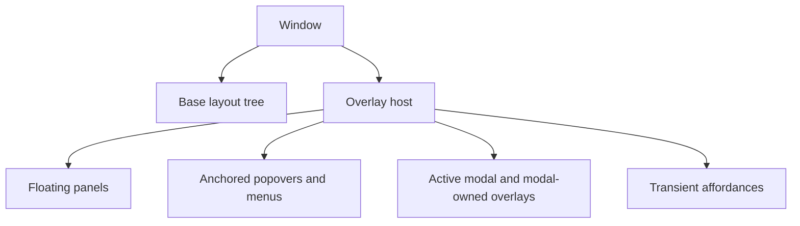

Free-floating UI never appears as an ad hoc child inserted into a row, column,
or application component. It is declared in the overlay host with a stable
identity, a placement policy, and explicit input, focus, and dismissal rules.

### Overlay contract

All in-window floating content uses one common overlay declaration.

```rust
overlay(inspector_contents(state))
    .kind(OverlayKind::floating_panel())
    .initial_placement(Placement::free(state.inspector.position))
    .size(state.inspector.size)
    .input(InputPolicy::interactive())
    .focus(FocusPolicy::activate())
    .dismiss(DismissPolicy::none())
```

An overlay owns its content, derived identity, kind, placement, size constraints,
input policy, focus policy, dismissal policy, and viewport-boundary behavior.
The application owns durable state such as whether the overlay exists, a free
panel's position and size, and the state projected into its content.

### Placement contract

Placement is a shared policy, not a separate implementation for each popup
kind.

```rust
enum Placement {
    Free(Point),
    Anchored {
        anchor: Anchor,
        candidates: PlacementCandidates,
        offset: Vector2,
        boundary: BoundaryPolicy,
    },
    Centered,
}

enum Anchor {
    Trigger,
    Key(AnchorKey),
    Pointer(Point),
    Rect(Rect),
    ViewportCorner(Corner),
}
```

The runtime resolves placement candidates, flips when necessary, and clamps or
resizes inside the selected boundary. Application code does not derive popup
coordinates from trigger rectangles.

### Context menu

A context menu is menu content inside an anchored overlay. It does not have a
separate rendering or input pipeline. Its command scope is explicitly derived
from the menu target, rather than inherited accidentally from current keyboard
focus or application selection.

```rust
scene(workspace(state))
    .overlay(
        menu([
            menu_item(CommandId::Open),
            menu_item(CommandId::Reveal),
            menu_separator(),
            menu_item(CommandId::DeleteSelection)
                .style(MenuItemStyle::danger()),
        ])
        .command_context(CommandContext::clip(clip.id))
        .anchor(Anchor::Pointer(state.context_menu_position))
        .placement(PlacementCandidates::MenuAtPointer)
        .dismiss(DismissPolicy::outside_press_or_escape(Message::CloseContextMenu)),
    )
```

### Floating panel

A floating panel has persistent in-window geometry and may be movable,
resizable, focusable, and closable. It remains an overlay rather than becoming
a second layout tree or an operating-system window.

```rust
scene(workspace(state))
    .overlay(
        floating_panel(
            column([
                panel_title("Inspector"),
                inspector_contents(state),
            ]),
        )
        .initial_placement(Placement::free(state.inspector.position))
        .size(state.inspector.size)
        .movable(Message::MoveInspector)
        .resizable(Message::ResizeInspector)
        .close_action(Message::CloseInspector),
    )
```

### Modal and auxiliary window

A modal owns its backdrop, focus trap, and modal input policy. Overlays opened
by the modal belong above that modal, while unrelated base-scene overlays do
not.

```rust
dialog(confirm_delete_dialog(state))
    .placement(Placement::Centered)
    .backdrop(Backdrop::dimmed())
    .input(InputPolicy::modal())
    .focus(FocusPolicy::trap())
    .dismiss(DismissPolicy::escape(Message::CancelDelete))
```

An in-window overlay is distinct from an operating-system window. A detachable
tool, plug-in editor, or document view uses an explicit top-level window API:

```rust
auxiliary_window(WindowKey::plugin_editor(plugin_id), plugin_editor(plugin_id))
    .title("Plugin editor")
    .size(720, 520)
    .close_policy(ClosePolicy::hide())
```

### Ordering, input, and focus

The overlay host orders content by ownership rather than by a fixed global list
of popup categories:

1. base layout;
2. ordinary floating panels and anchored overlays;
3. the active modal and its backdrop;
4. overlays owned by the active modal;
5. transient affordances, including drag previews.

Input routes to the topmost eligible overlay, then to the active modal backdrop
when present, then to base widgets. An overlay that activates focus receives it
when opened and restores the previous focus target when closed.

## Multi-window Architecture

Multiple native windows are a first-class projection of one application, not a
special overlay escape hatch. The application declares the windows that should
exist with typed, stable `WindowKey`s when they are dynamically projected.
Radiant owns native-window creation,
presentation, input integration, renderer state, lifecycle reporting, and
platform recovery for each declared window.

```rust
windows([
    app_window(WindowKey::main(), main_workspace(state))
        .title("Wavecrate")
    .initial_geometry(state.main_window_geometry),
    auxiliary_window(
        WindowKey::plugin_editor(plugin.id),
        plugin_editor(plugin),
    )
    .title(plugin.name.clone())
    .initial_geometry(state.plugin_window_geometry(plugin.id))
    .close_policy(ClosePolicy::hide(Message::HidePluginEditor(plugin.id))),
])
```

Each native window has its own root layout tree, window-local overlay host,
keyboard-focus target, pointer capture, accessibility tree, frame scheduler,
and retained renderer state. Windows share only application-owned immutable
state and messages; no live UI-tree, focus, overlay, or renderer object is
borrowed across a window boundary. A slow visualization or a blocked OS surface
in one window must not block input handling or frame scheduling in another.

Window-local shortcuts resolve through focused, overlay, and window scopes.
An application scope is explicit and receives only shortcuts not claimed by a
more local scope. Closing, minimizing, device loss, and recreation produce
typed lifecycle messages so application state can preserve geometry and decide
whether to hide, destroy, or reopen a window. Cross-window application behavior
is expressed with normal messages, never raw native-window handles.

## Native Platform Services

Radiant provides a typed, asynchronous platform-service boundary for desktop
capabilities that are neither widgets nor renderer concerns: application and
window menus, file/folder dialogs, clipboard, URLs, notifications, cursors,
and accessibility/native-window integration. Reducers return owned `Effect`s;
the runtime executes them after the state commit and returns an owned result
message. A service never blocks the input or frame path and never exposes a raw
platform handle.

```rust
fn update(&mut self, message: Message) -> Effects<Message> {
    match message {
        Message::ImportRequested => Effects::one(PlatformEffect::open_file_dialog(
            FileDialog::open()
                .title("Import audio")
                .filters([FileFilter::audio()])
                .on_result(Message::FilesChosen),
        )),
        Message::CopySelection => Effects::one(PlatformEffect::set_clipboard(
            ClipboardContent::text(self.selection_summary()),
        )),
        _ => Effects::none(),
    }
}
```

Menus are projections of the same semantic commands used by keyboard scopes,
toolbars, and command palettes. Their labels, enabled state, checked state, and
current shortcut display come from `CommandId`, not duplicated menu-specific
logic. Native service failures, cancellation, unavailable capabilities, and
permission denials return typed outcomes and structured diagnostics. Every
effect has an owner and cancellation key. The runtime deterministically cancels
or detaches it when its window closes, the app shuts down, or a newer effect
supersedes it; late completion messages are generation-checked before reducing.
The deterministic test host records effect requests and supplies their results,
so replay never calls a real OS service.

Clipboard access is an asynchronous platform service with the same explicit
boundary as drag and drop. An application may place a typed in-process payload
on Radiant's clipboard coordinator for copy/paste within its own windows, and
may attach safe external representations such as plain text, images, files, or
approved MIME data for other applications. The typed payload never crosses the
process boundary; it expires when its owning application instance closes, while
external representations remain subject to platform clipboard policy. Reads
request preferred representations and return an owned typed result, an
unsupported-format outcome, cancellation, permission denial, or unavailable
clipboard state. No clipboard read, conversion, file materialization, or
external import blocks input or the frame path.

## Widget Extension Contract

The public `Widget` trait is the leaf-widget extension point. Its required core
remains small: immutable declarative properties, intrinsic sizing, input output,
and paint. A projected widget value is never mutated by the runtime. Optional
concerns such as runtime-local state, timed repainting, text editing,
pointer-motion behavior, accessibility, and transient-overlay paint are focused
capabilities or internal adapters rather than reasons to burden every custom
widget implementation.

Every custom widget has a `WidgetRevision` derived from its immutable
properties. The default is `WidgetRevision::conservative()`, so a correct custom
widget need not hand-write invalidation bookkeeping. A widget on a measured hot
path may derive or explicitly supply separate structure, geometry, paint, and
interaction components. Reconciliation compares those components with the
prior widget of the same generated runtime identity and selects the
corresponding safe invalidation path. Public widgets never request raw repaint
scopes.

Revision components are exact comparable typed values. Hashes may be used as a
fast rejection prefilter, but a matching hash never by itself proves unchanged
content; Radiant confirms equality before reusing layout, paint, or input data.
When exact comparison is unavailable, the conservative path wins over a narrow
but potentially stale optimization.

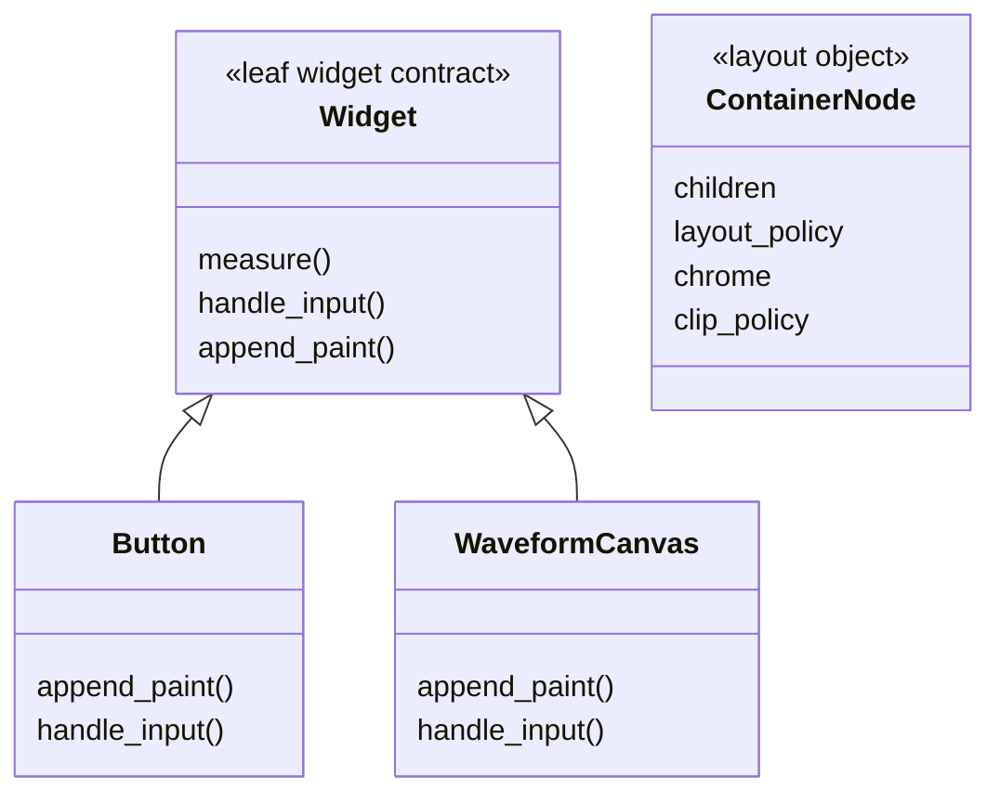

Containers do not move into the widget trait merely to achieve a uniform type
hierarchy. Custom widgets remain supported through a stable extension point.

An interactive custom widget opts into the focused `WidgetSemantics` capability
when it contributes accessibility information. That capability appends typed
role, label, value, state, relationships, and supported actions to Radiant's
semantic tree through a `SemanticsContext`; it never exposes platform
accessibility handles. Radiant combines it with the resolved tree order, focus,
visibility, virtualization, and native accessibility bridge, so a custom knob,
timeline item, or editor handle behaves like a built-in control.

```rust
struct MeterWidget {
    peak: f32,
}

impl Widget<Message> for MeterWidget {
    fn measure(&self, constraints: Constraints) -> SizeHint { /* leaf sizing */ }
    fn handle_input(
        &self,
        input: WidgetInput,
        context: &mut WidgetEventContext<Message>,
    ) {
        if input.is_activate() {
            context.emit(Message::ResetMeter);
        }
    }
    fn append_paint(&self, context: &mut PaintContext<'_>) {
        // Paint only inside assigned bounds; no layout or renderer-cache access.
    }
}
```

A custom widget supplies immutable view data, leaf sizing, input-to-message
behavior, and paint. Radiant assigns its stable runtime identity from the
surrounding declarative node; an application wraps it in `preserve_state` only
for the exceptional structural-continuity case. `WidgetEventContext` may request
focus, pointer capture, a transient repaint, or a typed runtime-local state slot
keyed by that generated runtime identity; Radiant owns that slot's initialization, replacement,
and destruction when the keyed widget disappears. It cannot expose mutable
application state, renderer resources, cross-thread references, or arbitrary
hidden retained state. This preserves message-first declarative ownership while
still supporting efficient drag, hover, caret, and gesture state.

Widget measurement, paint, input, accessibility, and overlay contexts expose
the same immutable `ResolvedEnvironment` and node-specific
`ResolvedAppearance` available to custom containers. A custom control therefore
receives resolved theme/style and interaction-state values, scale, locale,
direction, contrast, motion, and accessibility policy through normal Radiant
contexts, without retaining an application theme reference or reaching into a
renderer or platform API.

The default widget hit target is its assigned rectangle. A widget with a knob,
curve handle, sparse timeline region, or other non-rectangular affordance may
opt into `WidgetHitTest` and report a local opaque or pass-through hit shape.
Radiant applies the node's resolved bounds and clips, builds the normal hit-test
index, and routes through uncovered regions to eligible content beneath; custom
widgets never install a parallel pointer-routing system. Custom hit shapes are
pure, bounded, and allocation-free. The runtime first resolves a cached
axis-aligned bounds candidate from its spatial index, then evaluates a custom
local shape only for that candidate; shape data is cached by geometry and
interaction revision and never scanned across unrelated nodes on pointer move.

Widgets may opt into the same `Animatable` capability as containers. They
declare immutable target properties and transitions, while Radiant's central
animator owns timing, interpolation, retargeting, reduced-motion policy,
frame scheduling, and the narrowest safe invalidation path. Custom widgets do
not create timers, request perpetual redraws, or mutate their projected values
per frame.

`PaintContext` applies the resolved clip stack and culls empty or fully occluded
primitive bounds before recording the paint plan. It tracks primitive count and
encoded-byte estimates per node and subtree, with development diagnostics and
strict-test thresholds for unexpectedly dense emission. Radiant never silently
drops visible content to meet a budget; the diagnostic instead identifies the
emitting extension and recommends a paint canvas or render canvas when dense
data would otherwise flood the retained base paint plan.

Every runtime-local state slot has an explicit `WidgetStateId` containing the
generated widget runtime identity, concrete state type, and schema version. A matching identity retains
state only when all three match. Changing the type or schema deterministically
drops the old slot and creates the declared initial state, with a diagnostic in
development builds. State slots are window-local and cannot outlive their widget
or cross a renderer/window boundary.

The state type is required to be `'static` with an explicit initializer and
schema version; it is intentionally neither required nor permitted to cross the
window/UI boundary as shared widget state. This rules out borrowed application
references and accidental task capture while allowing ordinary `!Send` UI-local
types without synchronization overhead.

Runtime-local state is bounded per window. Mounted nodes retain their slots;
focused, pointer-captured, IME-composing, actively edited, or otherwise
interacting nodes are pinned until their interaction ends. Inactive virtualized
nodes use a bounded retention policy—visible-only by default, with an explicit
small recent-item policy where measured reuse justifies it. Eviction runs on the
owning UI runtime, releases state deterministically, and never reuses a slot for
a different identity or schema. Large durable data belongs in application state
or a renderer-managed resource, not an unbounded widget state slot.

Custom widgets do not bypass declarative invalidation, container layout, normal
hit testing, or renderer-owned resource lifetime. A changed widget projection
replaces its immutable inputs; runtime-local state survives only when its stable
generated identity survives reconciliation.

## Input, Focus, Accessibility, and Text

Input routing follows one deterministic model: topmost eligible overlay, active
modal backdrop when present, then the base widget path. Pointer events travel
to the resolved target; capture belongs to one widget and is cancelled when
that widget disappears. Scroll input is offered to the target, then chains to
eligible scroll containers. Drag/drop uses the same stable identity model, with
one shared runtime coordinator for internal, cross-window, and native external
transfers.

### Pointer, scroll, and gesture contract

Radiant normalizes mouse, trackpad, touch, pen, and native scroll input into
typed logical-coordinate events with timestamps, modifiers, device kind, and
capture lifetime. It distinguishes line scrolling from pixel-precise scrolling;
it never discards precision or guesses a scroll unit. Containers opt into
scroll chaining and zoom policies, while interactive editor widgets may declare
pan, pinch, rotate, selection, and pen behavior without interpreting raw
platform events.

```rust
arrange_view(state)
    .gestures(
        GesturePolicy::new()
            .pan(Message::PanArrange)
            .pinch_zoom(ZoomAnchor::pointer(), Message::ZoomArrange)
            .wheel_zoom(Modifiers::COMMAND, ZoomAnchor::pointer(), Message::ZoomArrange),
    )
    .on_pointer(Message::ArrangePointer);
```

Gesture recognition has explicit thresholds, cancellation, competition, and
pointer-capture rules. A pinch can cancel a pending drag; an active drag cannot
silently become a click. The runtime coalesces high-rate move/scroll updates to
the newest event per presentation opportunity while preserving boundary events
such as press, release, enter, leave, and capture loss. Custom widgets receive
the same normalized data and no raw platform handles.

Container layout interaction and child-widget input use one gesture arena. An
explicit container hit region, such as a splitter or dock handle, claims its
matching press before child hit testing. Otherwise the deepest eligible child
receives ordinary pointer input first; wheel input bubbles from that child to
scrollable ancestors that can consume it. Competing pan, drag, pinch, and
coordinate-viewport gestures remain pending until their declared threshold, then
the most specific eligible recognizer claims capture and cancels the others.
There is exactly one capture winner per pointer sequence. This lets a waveform
canvas receive an editing click, a coordinate viewport claim a pan after motion,
and an enclosing scroll container consume unhandled wheel input without
ambiguous or duplicated actions.

Keyboard focus follows declarative tree order unless a container declares an
explicit traversal policy. Focused text editing receives its required keys
before command routing; otherwise shortcut resolution follows the documented
contextual command-scope hierarchy. Focus is not selection: the runtime manages
one keyboard-focus target, while the application owns selected domain objects
and decides which gestures affect them. Closing an activated overlay restores
prior focus when that target still exists.

Every interactive widget exposes semantic role, label, value, enabled,
checked/selected state, and supported actions. Containers contribute semantics
only when they represent meaningful structure. Native accessibility bridges,
IME composition, selection, clipboard, undo/redo, and screen-reader output are
runtime capabilities; ordinary applications configure semantics declaratively.
Debug and inspector overlays are excluded from accessibility unless explicitly
made interactive.

### Text editing contract

Text controls support Unicode text shaping, bidirectional layout, font fallback,
logical and visual cursor movement, multiline editing, selections, IME
pre-edit/commit/cancellation, clipboard, and accessibility semantics. The
application owns the durable text value and edit history; Radiant owns transient
caret, composition, selection geometry, scroll-to-caret, and platform text-input
session state.

```rust
text_editor(state.notes.clone())
    .multiline()
    .placeholder("Project notes")
    .on_edit(Message::EditNotes)
    .on_submit(Message::CommitNotes)
    .commands([
        command_binding(CommandId::Undo),
        command_binding(CommandId::Redo),
    ]);
```

Edits are typed deltas with selection and composition boundaries rather than
unstructured per-keystroke callbacks. Applications may apply them to a string,
rope, CRDT, or document model and decide undo grouping; Radiant preserves the
native editing contract and never loses an IME composition because unrelated
state reprojected. Text measurement and paint use the same shaping result, so
wrapping, hit testing, caret placement, accessibility ranges, and rendering
cannot disagree.

Text shaping and line layout are retained resources. Radiant caches shaped runs
and resolved line layouts by immutable text content identity, font/style
generation, locale and writing direction, wrap width, tab policy, and display
scale. The cache is bounded, shared where safe across windows, and invalidated
only by the relevant key component. Editing invalidates the affected paragraph
or line range rather than reshaping an entire document; resize changes only
width-dependent line layout while reusing shaped runs. Cache hits, misses,
bytes, and shaping time are part of the normal frame profile.

## Frame Pipeline

Radiant has one pipeline with separately reusable stages.

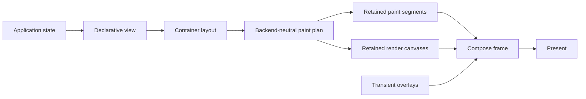

1. Application state projects a declarative container/widget tree.
2. The layout tree is refreshed only when structure or geometry changes.
3. Containers assign child bounds; widgets receive those bounds.
4. Containers emit chrome paint and widgets emit content paint into a
   backend-neutral paint plan.
5. The native backend encodes the base scene only when the base plan changes.
6. Retained render canvases render dense realtime content using their declared
   bounds and cache keys.
7. Transient overlays render hover, drag, caret, selection, and animation
   effects without requiring a base-scene rebuild when their contract permits.
8. The frame is presented.

The logical paint order is container chrome, child content, retained GPU
render canvases at their declared layer, then transient overlays. Every retained or
overlay path states its clipping, occlusion, hit-testing, and cache-key behavior
explicitly.

## Invalidation

Application code declares the *cause* of a change. The runtime chooses the
narrowest safe execution stage.

| Change cause | Required work |
| --- | --- |
| Tree structure changed | Reproject, relayout, and rebuild affected render boundaries |
| Geometry changed | Reproject, relayout, and rebuild affected render boundaries |
| Visual projection changed with stable geometry | Reproject and rebuild affected paint/render boundaries; retain geometry |
| Transient visual state changed | Repaint overlay only when it does not alter base content or geometry |
| Animation deadline | Request a frame; reuse the narrowest safe layer |

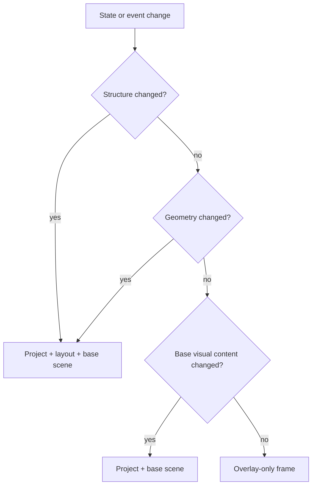

Any projected visual value that can affect intrinsic size, line wrapping,
baseline, overflow, or child placement is a geometry change. It never takes
the geometry-stable projection path.

Internal repaint scopes, scene dirty flags, and cache controls remain runtime
implementation details. Advanced hosts may access them explicitly, but normal
application code uses revisions or cause-based requests that cannot silently
select stale geometry or paint.

## Incremental Reconciliation and Damage

Radiant uses declarative reprojection with medium-grained reconciliation. A
fresh view value may be inexpensive to construct; the runtime compares it with
the previous keyed tree and updates only retained nodes whose relevant
declarative inputs changed. This is inspired by the useful part of reactive view
architectures: determine change from data and identity rather than requiring
application code to manually manage renderer dirtiness.

Each node exposes distinct structural, geometry, paint, and interaction
revisions. Reconciliation produces an internal `ViewDelta` that contains only
the changed subtrees and their classified effects.

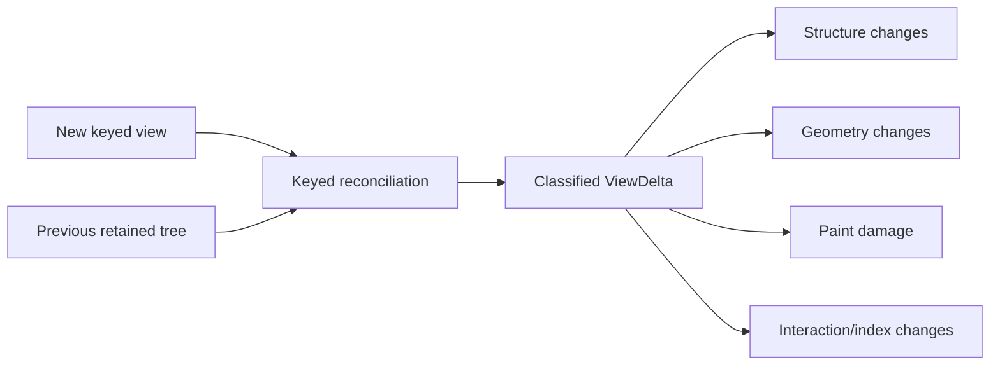

### Dirty propagation

- A structure change replaces the affected subtree and invalidates dependent
  layout, paint, input, accessibility, and native resources.
- A geometry change propagates through only the ancestors whose layout depends
  on that child; it stops at a proven layout boundary.
- A paint-only change marks the node's old and new painted bounds as damage,
  expanded for shadows, blur, transforms, and antialiasing.
- An interaction-only change updates the hit-test/focus data and transient
  overlay path without invalidating base paint when possible.
- A change to one keyed sibling does not reinitialize unchanged keyed siblings.

Unknown or incorrectly classified changes take the broader correct path. The
runtime never relies on application-supplied narrow invalidation as a source of
truth.

### Damage and render boundaries

Damage is a bounded set of clipped logical rectangles. Nearby regions may merge;
when fragmentation exceeds a configured threshold, the runtime promotes the
damage to the enclosing render boundary or full target. Damage includes both
the old and new bounds so moved or removed content cannot leave stale pixels.

Not every GPU backend can cheaply redraw an arbitrary rectangle of a complex
paint segment. Therefore damage selection chooses one of two correct reuse paths:

1. update only an isolated retained render boundary whose content intersects
   the damage; or
2. rebuild the smallest enclosing base scene when a partial update cannot be
   safely composed.

Render boundaries occur at explicit, measured isolation points such as a
scrolling viewport, a large virtualized list, a dense visualization, a
modal/overlay root, or a declared cacheable panel. They own an offscreen target
or retained scene only when the measured reuse benefit exceeds its memory and
composition cost. Radiant does not create a texture cache for every widget.

Cache admission uses a measured benefit model with hysteresis. A boundary is not
promoted on one lucky reuse; it must demonstrate repeated avoided work within a
bounded observation window. Once admitted, it remains resident through short
bursts of invalidation and is demoted only after sustained low benefit, memory
pressure, target-generation change, or explicit eviction. Budgeting is
hierarchical: an application-level manager accounts for shared text, image,
shader, pipeline, and device resources, while each window owns an independent
budget for retained paint segments, offscreen targets, and visible render-canvas
resources. Eviction respects both levels and evicts the lowest verified-benefit
entries within the responsible scope first, so one window cannot consume or
evict another window's working set. This prevents resize, scroll, zoom, and
overlay transitions from repeatedly allocating and destroying the same cache.

Damage is the single base-paint decision mechanism: it selects the smallest
valid render boundary, which redraws its local paint segment or falls back to
its enclosing scene. There is no competing unconditional base-scene rebuild for
ordinary paint changes.

### Viewport culling and virtualization

Containers with a viewport cull paint and hit-test work outside their resolved
clip. Large repeated collections virtualize child materialization and preserve
stable keys for visible and recycled entries. Reconciliation, layout, paint,
accessibility, and debug inspection operate on the same visible-window model;
they do not each invent their own list traversal.

## Rendering Backend Architecture

Radiant's public GUI model is renderer-neutral. Applications declare
backend-neutral paint primitives and render canvases; the native backend owns
device, resource, and presentation lifetime. No normal application API exposes
renderer handles or names a concrete renderer.

The architecture distinguishes **paint segments** from **render canvases**.
Paint segments are generated from Radiant's backend-neutral vector, text,
image, and shape primitives by the selected renderer adapter. A render canvas
is a leaf node whose data is rendered through a specialized retained backend
pass, using shaders, buffers, textures, atlases, compute work, or another
adapter-specific technique.

The current native renderer adapter uses Vello for paint segments and WGPU for
specialized render canvases. That is an implementation choice behind the
adapter boundary, not a Radiant naming or application-API commitment.

### Renderer resource topology

Renderer ownership has three explicit levels. An application-level adapter owns
the selected device/queue, adapter generation, shared shader and pipeline cache,
font/image caches, and device-loss coordination. A native window owns its
surface, physical target generation, frame scheduler, retained paint segments,
render-canvas instances, and composited targets. A submitted frame packet owns
or pins only the immutable resources it references until completion.

Windows therefore do not duplicate a device or compile identical programs into
independent global caches, while they remain isolated for layout, overlay,
input, damage, pacing, and presentation. Device loss increments the
application-level adapter generation, invalidates dependent native objects, and
causes each visible window to lazily rebuild its per-window resources on the
new adapter. Recovery is coordinated without a global UI lock or one window
waiting for another window's frame.

The shared adapter owns a fair GPU-work scheduler. Windows submit immutable
candidate work, not unbounded command streams. Before each submission the
scheduler admits work according to input/presentation urgency, declared canvas
freshness deadline, visible interaction, missed-frame history, and a per-window
quota. Submitted GPU work cannot be preempted, so Radiant bounds pass size,
upload bytes, and expensive canvas work before admission; it coalesces or lowers
detail for lower-value work instead of allowing one window to monopolize the
queue. Cross-window queue delay, admission, quota use, and deadline breaches
are recorded in the normal profile.

Admission uses an adaptive cost model built from measured CPU encoding time,
upload bytes, GPU duration, and peak transient memory for each program and
detail level. Unknown work starts with a conservative estimate and a small
warm-up allowance. Repeated cost overruns automatically reduce its admitted
detail, work quota, or prefetch priority until measurements show it is safe;
underestimates, estimate confidence, and automatic quality reductions are all
visible in profiles. The scheduler never assumes a new canvas is cheap merely
because it has not yet been measured.

### Render-canvas registration and portability

Radiant selects and owns the renderer internally. Ordinary applications never
select a renderer, capability set, fallback, shader backend, or native resource
policy at a canvas call site or window setup.

```rust
render_canvas(SpectrogramCanvas::new(state.spectrogram.tiles))
```

Render-canvas capability matching, fallbacks, and diagnostics are internal
adapter responsibilities. A future renderer replacement implements the same
backend-neutral paint-plan and render-canvas contracts behind Radiant's runtime;
applications continue to construct the same views. Backend migration is thus a
Radiant implementation task, not an application migration or public API mode.

### Custom render-canvas extension

Applications may define specialized visuals without importing a graphics API or
choosing a renderer at each call site. A render-canvas type is registered once
at application setup with a backend-neutral program descriptor, owned payload
type, bounded update contract, and portable fallback. The selected Radiant
adapter compiles or selects the native implementation and owns every pipeline,
buffer, texture, and retirement detail.

```rust
let app = RadiantApp::new(App::update, App::view)
    .register_canvas(SpectrogramProgram::new())
    .register_canvas(ArrangeTimelineProgram::new());

render_canvas(SpectrogramCanvas::new(state.spectrogram.visible_tiles()))
```

The normal extension contract is data-oriented: a canvas declares its stable
program identity, accepted immutable payload, logical uniforms, supported input
semantics, a renderer-neutral `CanvasGraph` for custom shader/compute behavior,
and a primitive-paint fallback. Radiant compiles that graph for the selected
adapter. The ordinary canvas contract does not receive a device handle, command
encoder, backend shader API, or per-frame mutable callback. Programs needing
unusual native techniques are isolated behind an advanced adapter extension with
an explicit capability declaration and fallback; that boundary is intentionally
small and does not alter the ordinary application API.

```rust
impl RenderCanvas for SpectrogramCanvas {
    type Payload = Arc<SpectrogramTiles>;

    fn program(&self) -> CanvasProgramId { CanvasProgramId::spectrogram() }
    fn payload(&self) -> Self::Payload { self.tiles.clone() }
    fn uniforms(&self) -> CanvasUniforms { self.uniforms }
    fn upload_plan(
        &self,
        viewport: CanvasViewport,
        previous: Option<&Self::Payload>,
    ) -> CanvasUploadPlan { self.tiles.plan(viewport, previous) }
    fn fallback(&self) -> PaintCanvas { spectrogram_placeholder() }
}
```

`CanvasPayload` is an immutable, bounded trait with an exact stable content
identity derived from its owned value or shared allocation; application code
never manually toggles a renderer revision. It also provides a viewport-aware
upload plan: visible tiles or ranges, detail level, immutable tile identities,
and the delta from the previous payload. The runtime requests only the tiles
intersecting the resolved clip and chosen level of detail, then uploads only
changed declared ranges. Waveforms, spectrograms, timelines, and large editors
therefore reuse offscreen tiles and decimation levels instead of rebuilding or
uploading their entire data set after a small change.

`CanvasUniforms` is a compact typed value, and `CanvasGraph` is a closed,
validated IR rather than arbitrary backend shader source. Registration validates
the graph, declared resource limits, fallback, and capability requirements once.
Adapter compilation and pipeline creation are cached by program identity and
generation, prepared off the interactive path when possible, and fall back
visibly rather than stalling a frame on failure.

Every `CanvasProgram` declares a `CanvasContractVersion` and typed capability
set. Registration succeeds only when the selected adapter supports that contract
version and every required capability. A newer or unsupported program is never
silently reinterpreted: Radiant selects its declared primitive-paint fallback or
returns a typed `UnsupportedCanvasContract` diagnostic. Contract versions are
additive within a compatibility line; a breaking interpretation requires a new
version and explicit fallback.

Radiant derives updates by exact comparison of the canvas key, program identity,
payload content identity, uniforms, bounds, and target generation. Hashes can
accelerate lookup but never alone authorize reuse. An application may update a
visualization at display cadence without manually invalidating renderer caches
or managing synchronization primitives.

### Rendering vocabulary

- **Paint primitive:** a backend-neutral command such as fill rectangle, stroke
  path, text run, image, clip, transform, or gradient.
- **Primitive painting:** normal widget and container rendering expressed as an
  ordered paint plan of paint primitives.
- **Paint canvas:** a leaf node for application-defined drawing expressed with
  the same paint primitives and normal paint context.
- **Render canvas:** a leaf node with a specialized retained rendering contract
  for shaders, buffers, textures, atlases, compute work, or other complex
  native rendering techniques.

Built-in controls use primitive painting. A custom visual that only needs
shapes, lines, text, and images uses a paint canvas. A dense waveform,
spectrogram, analyser, or shader-driven visualization uses a render canvas.

Rendering mechanism and composition lifetime are independent axes:

```text
                    Base content              Transient overlay
Primitive painting  panel, button, text        hover, caret, tooltip
Render canvas       waveform, spectrogram      specialized preview, if needed
```

Transient content is composed late and may update without rebuilding unchanged
base content.

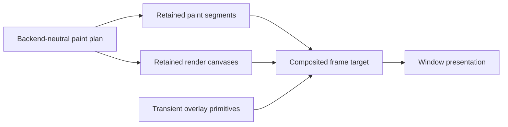

### Rendering layers

The renderer has two rendering mechanisms and one orthogonal composition
category:

1. **Paint segments.** Container chrome, ordinary widgets, images, paths, and
   text lower from the paint plan into retained renderer-adapter segments.
2. **Retained render canvases.** Dense or realtime leaf nodes such as waveforms,
   spectrograms, editors, and visualizations render through an explicit canvas
   contract at their declared paint position.
3. **Transient overlays.** This is not a separate rendering mechanism. Hover
   feedback, drag previews, carets, selection handles, and similar short-lived
   affordances are usually primitive-painted content composed last. They reuse
   normal content whenever they do not change layout or base paint.

The paint planner preserves declared z-order by emitting ordered render
segments: `paint segment → render canvas → paint segment → render canvas`, followed by transient
overlays. Every segment uses the same resolved bounds, clip stack, alpha, and
occlusion rules. A render canvas is a leaf node with a specialized render path,
not a parallel scene graph. Transient overlay status is orthogonal: a transient
overlay normally uses primitive painting, and only uses a render canvas when
its own content genuinely requires specialized rendering.

### Reuse and invalidation

Each reusable layer has an explicit revision contract.

| Layer | Rebuilds when | Reuses when |
| --- | --- | --- |
| Layout output | tree structure, geometry, viewport, or layout state changes | paint-only and geometry-stable projection changes |
| Paint plan | layout, theme, or base widget paint data changes | transient-only frames |
| Retained paint segments | base paint plan, physical target size, DPI, or renderer resource generation changes | overlay-only frames |
| Render canvas resources | canvas identity, derived content revision, geometry, or renderer resource generation changes | unchanged canvas content and bounds |
| Transient overlay | transient state changes | never retained beyond its valid frame unless its own contract permits it |

The runtime owns these revisions. Application code provides stable widget and
canvas identities plus declarative content; it does not manually
invalidate renderer-adapter caches or native resource bindings.

### Render canvas contract

Specialized visual content is explicit about what can change independently of base
layout and paint:

```rust
render_canvas(SpectrogramCanvas::new(state.spectrogram.visible_tiles()))
    .on_input(Message::SpectrogramInput)
    .clip(Clip::bounds())
```

The application supplies content. The runtime derives canvas identity from the
surrounding node unless an advanced continuity key is explicitly requested; the
render-canvas implementation and runtime derive content revisions, native resources, and
updates internally. The backend recreates resources only when the relevant
canvas content, geometry, or renderer generation changes.

### Steady-state frame rule

An idle or overlay-only frame does not reproject the base view, remeasure the
layout tree, regenerate the base paint plan, re-encode retained paint segments, or
re-upload unchanged render-canvas data. It presents the retained base frame and
only the valid changing layer.

This is the primary performance principle. Optimizations are accepted when they
make this rule truer for a named workload without weakening layout, clip,
ordering, or input correctness.

### Renderer-owned resources

The native renderer owns and reuses:

- primitive-renderer scenes and renderer state;
- glyph, image, and vector-path resources;
- paint-plan and scene-encoding scratch buffers;
- render-canvas pipelines, textures, buffers, and bindings;
- composited base-frame targets used by transient presentations.

Per-frame work uses reusable storage where possible. Application-facing APIs
remain declarative and never require clients to manage these resources.

### Realtime visualization canvases

Primitive painting is the preferred path for ordinary vector UI, text, icons,
controls, and small static or moderately changing graphs. A render canvas is preferred when
content is data-dense, updates at display cadence, benefits from texture or
buffer sampling, or would require excessive CPU-side geometry generation.

| Content | Preferred path | Reason |
| --- | --- | --- |
| Button, panel, text, icon, simple curve | Primitive painting | High-quality ordinary UI paint data |
| Slowly changing EQ curve | Primitive painting or render canvas, chosen by measurement | The simple path is usually sufficient; specialized rendering is justified only at meaningful update density |
| Interactive EQ editor with dense analysis | Render canvas plus primitive-painted handles | Retained data draw path; precise editing chrome remains declarative |
| Waveform with large zoomable sample data | Render canvas | Buffer/texture-backed decimation and viewport updates avoid CPU geometry churn |
| Spectrogram | Render canvas | Texture/tile sampling and color mapping are naturally specialized rendering work |
| Peak/RMS meters and analyser bars | Render canvas when many or display-rate updates; primitive painting otherwise | Choose by measured count and update cadence |

Render canvases use stable identity, immutable program descriptors, derived
content revisions, and bounded payloads. Their shaders are renderer-owned assets with
validated descriptors, explicit uniforms, and no application access to raw
device handles. A render canvas may expose semantic widget input and overlay paint
for editing, selection, and tooltips.

### Render-canvas scheduling and budgets

Render canvases share a per-window frame budget and application-level adapter
budgets for upload bandwidth, transient memory, compute work, and pipeline
creation. The window scheduler first culls clipped or occluded canvases, then
ranks visible work by active interaction, explicit application importance,
recency, and visual staleness. Its admitted candidate work then participates in
the shared adapter's cross-window fairness scheduler. A deferred canvas presents
its last valid frame rather than blocking unrelated UI work.

```rust
render_canvas(SpectrogramCanvas::new(state.spectrogram.visible_tiles()))
    .importance(CanvasImportance::interactive())
    .update_policy(
        CanvasUpdatePolicy::latest_wins()
            .target_rate(FrameRate::Hz60)
            .max_staleness(Duration::from_millis(100)),
    );
```

The default policy already prioritizes visible and pointer-interacting canvases;
the optional importance hint is for cases such as a recording meter, active
transport, or foreground editor. No canvas may monopolize a frame by repeatedly
uploading stale data or compiling work synchronously. Target rate expresses
desired smoothness; maximum staleness is a bounded-freshness contract. When the
budget cannot satisfy every request, the scheduler first reduces detail level or
coalesces intermediate payloads, then records a deadline breach rather than
silently starving a canvas. Profiles record requested, admitted, deferred,
dropped, uploaded, detail-reduced, and deadline-breached canvas work so quality
degradation is measured and tunable rather than hidden.

### Animation architecture

Animation is a runtime service, not a collection of per-widget timers or
application-driven repaint loops. Declarative views state target values and
transition policy; the runtime owns the active animation set, monotonic clock,
frame wakeups, interpolation, retargeting, and completion.

```rust
button("Record")
    .style(ButtonStyle::danger())
    .when(state.record_armed, |button| button.opacity(1.0))
    .when(!state.record_armed, |button| button.opacity(0.65))
    .transition(Transition::ease_out(Duration::from_millis(140)));

overlay(notification(state.message))
    .transition(Transition::fade_and_slide(Duration::from_millis(180)));
```

The target API describes intent, not frame-by-frame values. An animation has a
stable owner identity, property, start value, target value, start time,
duration, easing curve, and interruption/retarget policy. Updating a target
while an animation is active retargets from the current interpolated value;
it does not restart visibly or allocate a new timer.

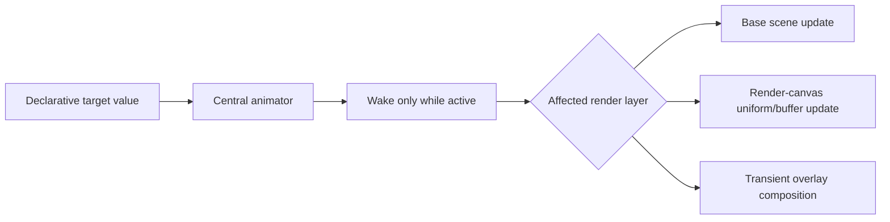

Animations select the narrowest valid layer based on their property:

- transient position, opacity, hover, drag, caret, and overlay effects use the
  transient layer whenever they do not alter base content or geometry;
- render-canvas animation updates specialized uniforms or buffers without
  rebuilding unrelated UI;
- a base-widget property that changes base paint re-encodes the affected base
  scene path as required, but does not force layout unless it changes geometry;
- geometry-affecting animation, such as size or layout position, uses the
  normal geometry path and is reserved for deliberate cases.

The animator requests frames only while work is active. It coalesces all active
animations into one frame deadline, uses reusable active-set storage, and stops
waking immediately after completion. Large visualization data does not pass
through generic animation values; it stays in the render-canvas data contract.

Indeterminate feedback animations such as spinners and skeleton shimmer use a
shared effect clock and a bounded animation budget, never one timer or wakeup
per visible primitive. Identical effects coalesce into shared phase state;
offscreen, occluded, paused-window, or low-priority instances stop advancing
first under pressure. Reduced-motion policy selects a static readable state.
Profiles report active feedback instances, shared-effect groups, skipped work,
and animation-budget pressure so a large loading list cannot silently consume a
frame budget.

### Backend implementation model

The native backend is organized by frame responsibility. Each component owns
one cache boundary and exposes data, not renderer internals, to adjacent
components.

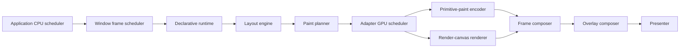

| Component | Owns | Must not own |
| --- | --- | --- |
| Application CPU scheduler | cross-window CPU admission, stage quotas, input/presentation priority | window-local layout or renderer resources |
| Window frame scheduler | wakeups, animation deadlines, local coalescing, presentation requests | application state or cross-window GPU admission |
| Adapter GPU scheduler | cross-window GPU admission, quotas, deadlines, and cost estimates | declarative view, layout, or application mutation |
| Declarative runtime | projected view, stable identity, input routing, change causes | native GPU resources |
| Layout engine | measured sizes, layout rectangles, virtualization state | paint encoding or input-specific rendering |
| Paint planner | backend-neutral primitive order, clips, paint revisions | adapter pipelines or window presentation |
| Primitive-paint encoder | retained paint segments, adapter state, text/image/path encoding | application-owned canvas payloads |
| Render-canvas renderer | retained canvas resources and canvas-specific draw passes | general widget traversal or layout |
| Frame composer | base target, layer order, clip/occlusion composition | application state mutation |
| Presenter | swapchain acquisition, submission, and presentation | layout and paint planning |

### Frame state

The renderer keeps a single reusable frame state per native window. Its shape
is conceptually:

```rust
struct WindowFrameState {
    layout: LayoutOutput,
    paint_plan: SurfacePaintPlan,
    base_paint: RetainedPaintSegments,
    base_frame: Option<CompositedFrame>,
    render_canvases: RenderCanvasCache,
    overlay_scratch: OverlayScratch,
    scene_revision: SceneRevision,
    target_generation: TargetGeneration,
}
```

The names are illustrative; the ownership rule is normative. Frame state is
long-lived and reusable. It is recreated only for a native-window, device, or
physical-target generation change, not for ordinary input or animation frames.

### Frame decision sequence

For every requested frame, the scheduler evaluates the narrowest valid path in
this order:

1. Coalesce pending application messages, resize events, and timed work.
2. Determine whether tree structure changed.
3. Determine whether layout geometry changed.
4. Determine whether base paint content changed.
5. Determine which retained render canvases changed independently.
6. Determine whether only transient overlay content changed.
7. Execute only the required stages, then compose and present once.

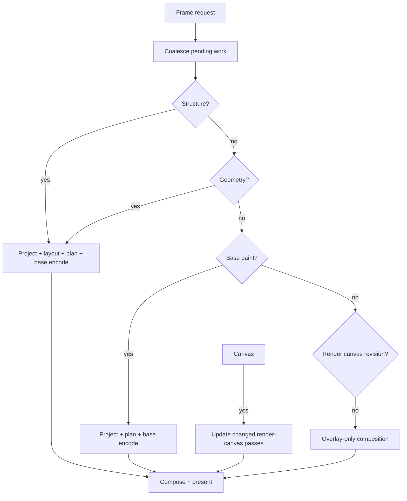

### Efficiency rules

- Coalesce multiple updates into one presentation opportunity.
- Reuse vectors, scenes, command-side scratch, and GPU allocations across
  frames; grow capacity amortized rather than allocating per primitive.
- Upload only changed render-canvas payload ranges where the canvas contract
  makes that possible.
- Keep clipping and occlusion analysis in the paint-plan stage and share its
  result with render canvases and overlays; do not rescan the primitive list in
  each render pass.
- Keep text and image resource caching renderer-owned and keyed by immutable
  content plus renderer generation.
- Treat resize, DPI changes, and device loss as explicit target-generation
  changes that invalidate dependent native resources safely.
- Measure a named interaction before introducing a new cache, pass, or
  abstraction. The optimal architecture is the one that preserves these
  contracts with the least verified work for that interaction.

### Realtime integration boundary

Radiant is a GUI runtime, not an audio engine. It provides no audio-device I/O,
DSP graph, transport clock, plug-in host, or realtime callback API. An
application such as a DAW owns those systems and may integrate them with
Radiant only across this boundary.

The UI, layout runtime, renderer, effects, and GPU upload preparation never run
on an audio or other realtime callback. A realtime callback never calls
Radiant, waits for UI work, allocates unpredictably, takes a contended lock,
performs synchronous I/O, wakes a worker, or submits GPU work. Conversely,
Radiant never waits on a realtime callback or takes a lock shared with it.

The application owns two bounded, non-blocking bridges:

- The realtime system publishes completed observations through a callback-safe,
  preallocated handoff such as an atomic double buffer or bounded ring. It does
  not allocate, refcount, free, or otherwise reclaim an application payload on
  the realtime callback; reclamation occurs on a non-realtime owner. The UI
  reads only the latest fully available observation and never requests, waits
  for, or reconstructs realtime work. Each observation carries a monotonic
  engine revision or sample-time marker so presentation can identify freshness
  and temporal ordering without guessing. The bridge declares its reader/writer
  ownership protocol: a producer may not overwrite a buffer still being read,
  and a buffer returns to producer reuse only after the reader releases it. A
  sequence-checked copy protocol is also valid when the copied observation is
  bounded and retry behavior is explicit.
- The UI publishes intent through command lanes with explicit semantics.
  Ordered discrete commands—such as transport start/stop, record-arm, edit
  commit, and device changes—preserve their declared order and are never
  silently replaced. Continuous controls—such as faders, drag positions, and
  scrub previews—may use a latest-wins lane. Every lane is bounded and
  non-blocking: enqueueing never waits, and its pressure policy is explicit
  (`coalesce`, `drop`, or `reject`) together with timing and acknowledgement
  semantics. A discrete command that cannot be admitted produces a typed
  rejection or acknowledgement outcome; the UI never assumes it reached the
  engine merely because it was requested.

Meter, waveform, spectrum, transport, and automation views consume sampled or
decimated analysis data rather than callback-owned buffers. They declare their
sampling rate, freshness target, drop policy, and backpressure behavior. Visual
freshness is a GUI policy and never changes the realtime deadline; sample-time
markers let a view display an honest latest-known state rather than fabricate
synchrony with the engine. When an application needs smooth timeline display,
it additionally publishes an immutable clock-correlation observation that maps
engine sample time to monotonic UI time. It advances on normal playback and
explicitly records discontinuities such as seek, stop, loop wrap, device reset,
or a changed engine revision. Radiant consumes this only as application data;
it does not own an audio clock or infer audio timing.

The integration is intentionally generic: the same contract applies to any
deadline-sensitive engine. Development diagnostics may report bridge age,
coalescing, drops, and queue pressure, but must not instrument or block the
realtime callback itself.

### Native failure recovery

Native rendering failure preserves application state and produces a structured
diagnostic. The runtime recovers the narrowest invalid native resource for
swapchain acquisition/presentation failure, device loss, renderer
reinitialization, shader or pipeline creation failure, and malformed or
oversized canvas payloads. A single custom render canvas may degrade to a visible
error state, but it must not take down the entire window. Unsupported profiling
or GPU capabilities report unavailable rather than blocking or fabricating
results.

### Resource and display policy

Renderer caches, render canvases, profiling buffers, debug traces, images, glyphs,
paths, and retained frame targets have explicit memory budgets and deterministic
eviction or degradation behavior. Long-running projects must not retain
unbounded native resources.

Eviction removes a resource from future admission immediately, but physical
destruction is deferred until its submitted-frame fence completes. Retirement
queues are bounded, polled without waiting, and reclaimed in small maintenance
units after presentation or on a background-capable adapter path. Memory pressure
may force quality reduction or admission refusal before it permits synchronous
GPU waits, large destructor cascades, or allocator churn on the frame path.

Physical target size, DPI scale, monitor migration, fractional scale, and color
space are native-window inputs to the frame target generation. A target
generation change invalidates dependent native resources while preserving
logical layout, application state, and stable identities.

## Profiling Architecture

Profiling is a first-class Radiant runtime capability. It is available for
every native window and can be enabled without changing application code. Its
purpose is to explain the work of a frame from application update through
layout, paint planning, GPU encoding, and presentation.

### Profiling modes

```rust
enum ProfilingMode {
    Off,
    Frame,
    Detailed(ProfileSelection),
}
```

| Mode | Cost and behavior |
| --- | --- |
| `Off` | No per-frame timestamps, counters, trace allocation, or GPU queries. Production default. |
| `Frame` | Fixed-cost timings and counters for each major frame stage, stored in bounded reusable buffers. |
| `Detailed` | Adds selected widget, container, paint-plan, render-canvas, and input-route scopes; intended for diagnosis, not permanent production use. |

Profiling implementation is feature-gated so production builds that omit the
feature compile out detailed instrumentation. When the feature is present,
`Off` remains the default and follows a fast branch with no heap allocation or
GPU timestamp work.

```rust
app(state)
    .profiling(ProfilingOptions::frame())
    .run()

// Development tools may change the mode at runtime.
runtime.set_profiling_mode(ProfilingMode::Detailed(
    ProfileSelection::inspected_node(),
));
```

### What a profile records

Every frame profile has a stable frame sequence number, invalidation cause,
and a fixed set of stage measurements:

```text
frame
├── application message drain and projection
├── layout measurement and placement
├── paint-plan generation and clip/occlusion analysis
├── primitive-paint encoding and rendering
├── changed render-canvas upload and draw work
├── transient-overlay generation and composition
└── submission and presentation
```

It also records counts needed to explain time: projected nodes, measured nodes,
layout cache hits/misses, paint primitives, encoded text runs, GPU uploads,
pipeline/bind-group rebuilds and cache hits, retained render-canvas reuse, and
presentation outcome. Memory and churn counters include resident runtime-state
slots, pinned and evicted virtualized slots, retained state bytes where an
extension declares them, resource-interest transitions, shared-effect admission,
cancellation, restart, and retained payload bytes.

### Detailed scopes

Detailed mode supports three kinds of scoped diagnosis:

- **tree scope:** one selected container subtree, showing projection, measure,
  layout, and paint contribution;
- **widget scope:** one selected widget identity, showing input, retained
  state synchronization, paint, and overlay contribution;
- **canvas scope:** one selected render-canvas identity, showing payload bytes,
  resource reuse, pipeline/bind-group reuse, draw time, and GPU timestamp data
  when the adapter supports timestamp queries.

The profiler uses stable numeric identities and interned labels. It does not
format strings, allocate trace events, or retain unbounded history during a
frame. Detailed traces are written to a fixed-capacity ring buffer and may be
exported after capture.

### CPU and GPU timing

CPU stage durations use a monotonic clock around explicit architecture
boundaries. GPU timing uses timestamp queries when supported by the selected
adapter. GPU results are resolved asynchronously and attached to the matching
frame after they become available; the profiler never blocks presentation to
wait for them. Unsupported GPU timestamps are reported as unavailable, not
fabricated as CPU time.

### Profile output

Radiant exposes a structured `FrameProfile` stream for development tools,
automated tests, and benchmark scenarios. The devtools overlay may show a
compact rolling frame view; detailed reports provide per-stage totals,
percentiles, cache rates, selected-scope traces, and an explicit invalidation
path for each captured frame.

```text
Frame 418  ·  geometry change
layout: 0.42 ms  ·  base paint: 0.71 ms  ·  render canvas: 0.18 ms
paint primitives: 1,246  ·  layout cache hit rate: 94%  ·  uploads: 32 KiB
```

Profiles are comparable by named workload. Baselines record percentile frame
time and the relevant work counters, so a proposed optimization must demonstrate
which work it removed rather than merely reporting a faster single frame.

### Profiling invariants

- The disabled profiler does not change rendering decisions or frame ordering.
- Profiling buffers are bounded and reusable.
- Detailed per-node timing is opt-in and selection-scoped.
- GPU timing never stalls a frame.
- A profile identifies both elapsed time and the invalidation decision that
  caused the work.
- Performance tests consume the same profile data as the development UI.

## Debug and Inspection Architecture

Debugging is a first-class Radiant runtime capability, separate from profiling.
Profiling explains cost; debugging explains structure, geometry, routing, and
state. It is available on every native window and can be enabled without
changing application views.

### Debug modes

```rust
enum DebugMode {
    Off,
    Layout(DebugLayoutOptions),
    Inspector(DebugInspectorOptions),
    Verbose(DebugInspectorOptions),
}
```

`Off` is the production default. It adds no debug paint, inspector traversal,
or diagnostic-event capture. Debug modes are feature-gated for production
builds that do not need them and may be toggled at runtime in development.

```rust
runtime.set_debug_mode(
    DebugMode::Inspector(
        DebugInspectorOptions::default()
            .show_bounds(true)
            .show_ids(true)
            .show_sizes(true),
    ),
);
```

### Visual layout overlay

The debug overlay is a final developer-only pass above normal content,
render canvases, modal-owned overlays, and transient overlays. It never changes
normal layout, clipping, paint order, or input routing. It may visualize:

- container bounds, padding, content bounds, slot bounds, and scroll viewport;
- widget bounds, stable identity, type/kind, intrinsic size, and assigned size;
- layout constraints, alignment, overflow, and virtualized ranges;
- clip boundaries, overlay ownership, modal boundaries, and render-canvas bounds;
- focus, hover, pointer capture, and hit-test path.

Container and widget visuals use distinct colors and label conventions. For
example, container outer bounds may use red, content bounds orange, widgets
green, clips blue, and the actively inspected path a high-contrast highlight.
Color is supplementary to label and line-style differences.

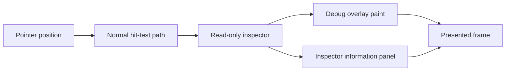

The inspector observes the normal hit-test result. It does not create a second,
inconsistent hit-test system. Its pointer observation is pass-through unless a
developer explicitly pins or interacts with the inspector panel.

### Hover and pinned inspection

Moving the pointer over the window selects the topmost eligible node and shows
a compact information panel. A developer can pin the current node or select an
ancestor in the declarative path.

```text
Widget: waveform-canvas
ID: waveform/main
Bounds: x 24, y 108, width 920, height 220
Layout: fixed height; clipped by workspace-scroll
Input: hover; pointer capture inactive
Paint: render canvas; content revision 184
Frame: base scene reused; render-canvas upload 32 KiB
```

The panel can expose a tree-path view from window root through containers to the
selected widget, together with the selected node's layout constraints, resolved
style, invalidation cause, and last profile data when profiling is active.

### Structured diagnostics and logging

Radiant emits structured diagnostic events for important state transitions and
anomalies. Diagnostic categories include:

- projection and stable-identity reconciliation;
- layout constraints, overflow, clipping, and virtualization;
- input route, focus transition, pointer capture, and dismissal;
- overlay placement, flip, clamp, focus, and dismissal;
- invalidation decision, cache reuse, paint-plan generation, and scene rebuild;
- GPU resource creation, reuse, upload, pipeline/bind-group rebuild, and
  renderer/device error;
- frame scheduling, presentation outcome, and dropped or delayed frames.

Each event uses stable identifiers, category, severity, frame association, and
structured fields. Human-readable formatting is performed only by a chosen
sink such as a development console, devtools panel, or exported report.

```rust
diagnostics.subscribe(DiagnosticFilter::default()
    .category(DiagnosticCategory::Layout)
    .minimum_severity(Severity::Warning));
```

Normal operation records only bounded, high-value diagnostics. Verbose mode or
a selected-node scope enables detailed event capture in a bounded ring buffer.
No unbounded log growth, per-frame string formatting, or synchronous disk IO is
permitted on the rendering path.

### Debugging invariants

- Debug overlays are read-only and do not perturb normal geometry or paint.
- Inspector selection reuses the normal resolved tree and hit-test path.
- Debug and profiling data may be correlated by frame and stable identity.
- Detailed capture is bounded, opt-in, and selection-scoped.
- Errors and warnings identify the relevant node, layer, render canvas, or frame and
  provide the surrounding decision context needed to diagnose them.

## Performance and Verification Requirements

The architecture remains observable. Frame-work changes identify their relevant
workload and report one or more of:

- projected widget count;
- measured/layout node count and cache-hit rate;
- paint primitive count;
- base-scene encoding duration;
- GPU upload bytes;
- retained render-canvas cache-hit rate;
- steady-state allocation or frame duration.

Representative workloads are idle presentation, pointer hover, large-list
scrolling, waveform pan/zoom, text editing, resize, and transient animation.

The test suite verifies the public API contract, layout behavior, input
routing, layer ordering, and invalidation rules. Performance scenarios verify
that the intended reuse boundaries remain real rather than documentary.
